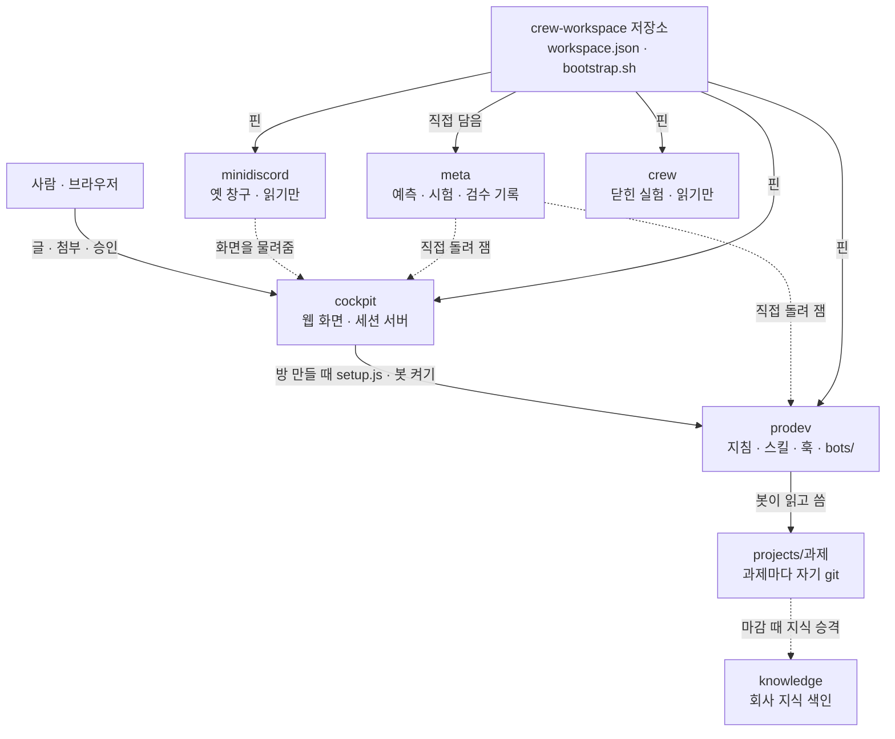
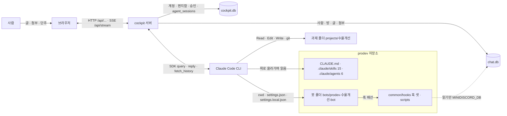
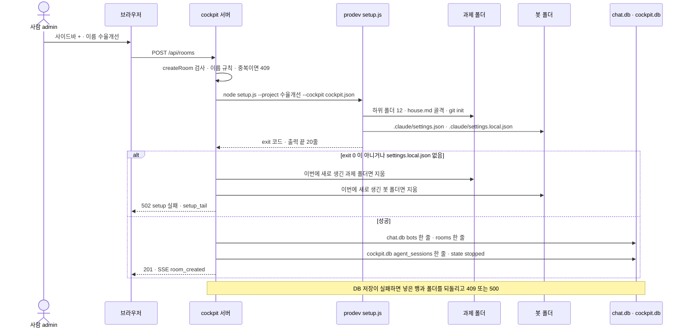
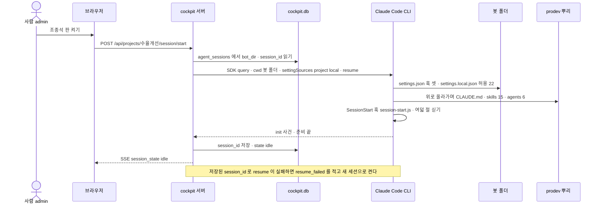
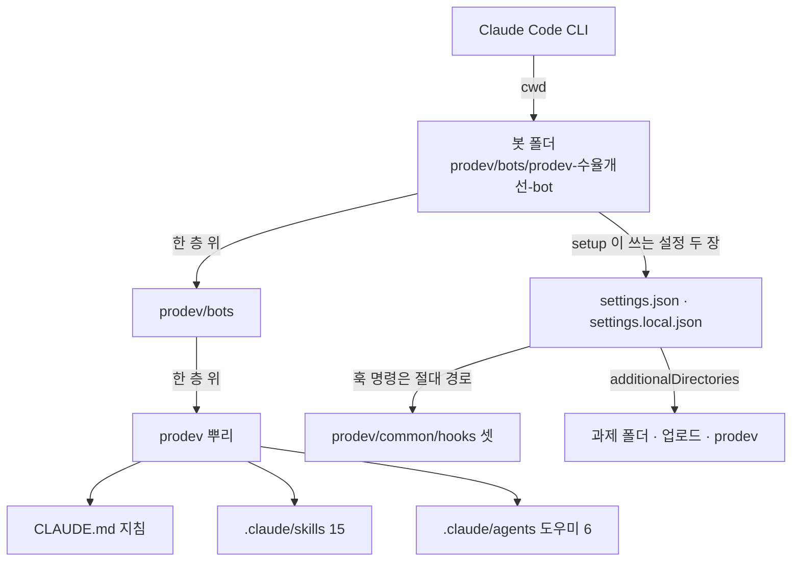
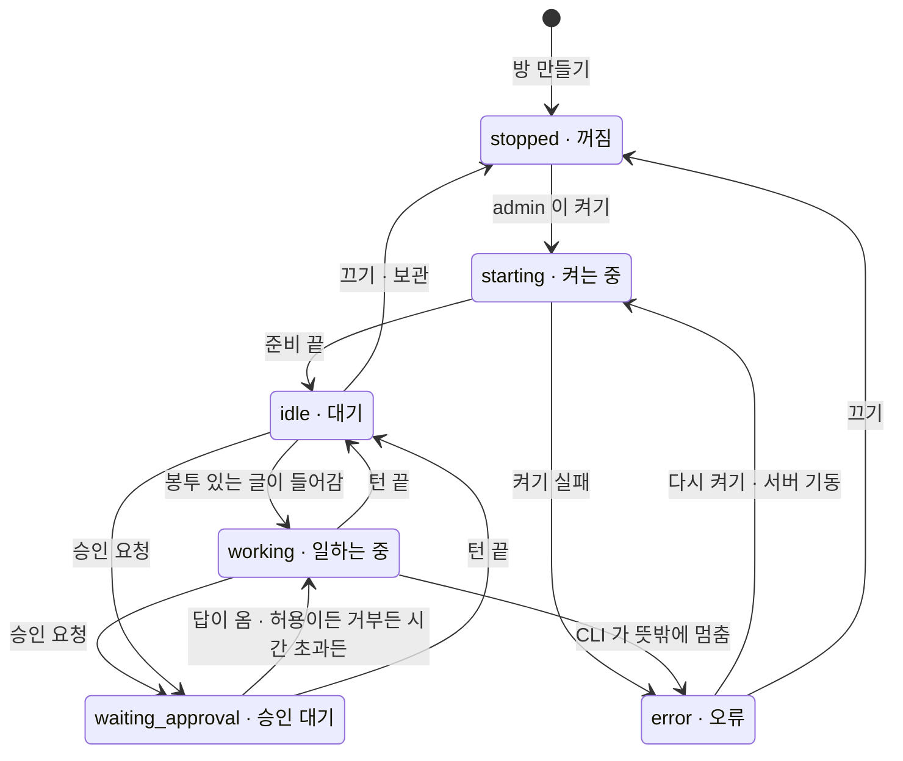
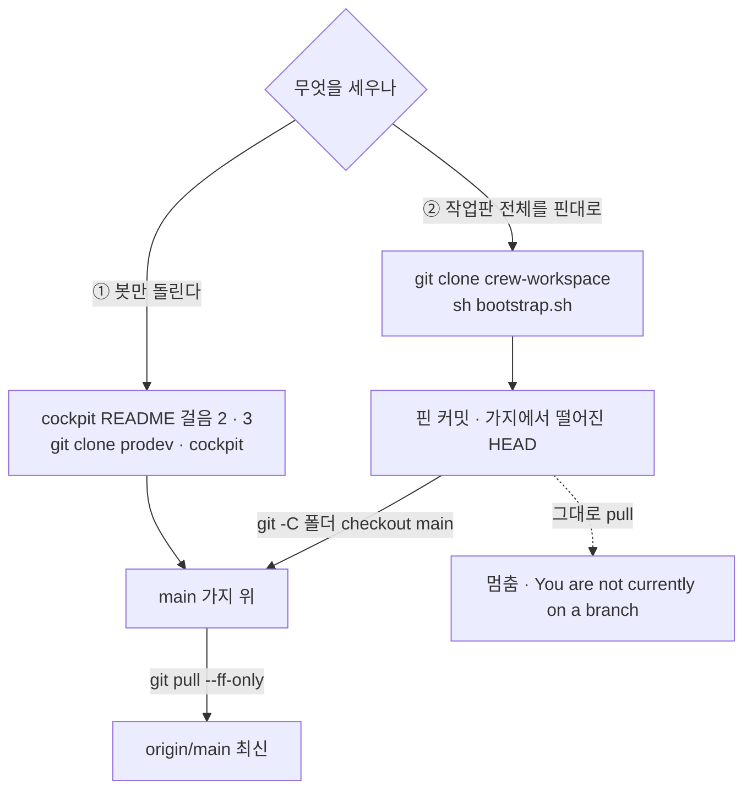

# crew-workspace

회사 과제를 돕는 비서 봇 **prodev** 를 한곳에서 다루는 작업 폴더다. 여기서 봇의 규칙을 만들고(`prodev/`), 사람이 브라우저로 봇과 이야기하는 창구를 돌리고(`cockpit/`), 만든 사람과 다른 자리에서 결과를 재어 검수한다(`meta/`).
이 문서는 **2026-09-15 판(v2, 새 판)** 이다. 새 판에서는 사람이 cockpit 웹 화면으로 봇과 이야기한다. 옛 판(2026-09-13)은 minidiscord 라는 채팅 서버를 창구로 썼고, 맨 아래 9절에 접어 두었다.

**괄호 속 `파일:줄` 과 `ADR-0xx` 는 근거 표시다.** 몰라도 읽는 데 지장이 없다. 읽는 규칙은 10절 끝에 있다.

## 0. 먼저 낱말

위 줄의 낱말이 아래 줄을 풀도록 차례를 맞췄다. 처음에는 0.1 만 보고, 0.2 · 0.3 은 막힐 때 돌아와 본다.
**찾아보기:** 사람 · 화면 · 과제 자료에 관한 말은 0.1, 프로그램 · 파일 · git 에 관한 말은 0.2, `409` 같은 숫자는 0.3.

### 0.1 기본 낱말

| 말 | 한 줄 풀이 |
|---|---|
| **과제 · PL · 로트** | 과제는 회사에서 몇 달 쫓는 일 하나, PL 은 그 책임자다. 예: `수율개선` (수율 = 만든 것 가운데 쓸 만한 비율). 로트는 한 번에 같이 만든 묶음이다 |
| **봇** | 과제 하나를 맡는 AI 비서다. 예: `prodev-수율개선-bot` |
| **방 · 사이드바 · 작성기** | 방은 사람과 봇이 글을 주고받는 채팅 창 하나다(과제 하나에 하나). 사이드바는 화면 왼쪽 방 목록, 작성기는 글 쓰는 칸이다 |
| **서버 · DB** | 서버는 늘 켜 두고 브라우저 요청을 받는 프로그램이다. DB 는 서버가 표 모양으로 자료를 적는 파일이다(`chat.db` · `cockpit.db`) |
| **터미널** | 글자로 명령을 치는 창이다. 맥은 "터미널", 윈도우는 "PowerShell" |
| **경로 · 절대 경로 · 뿌리** | 경로는 파일이 있는 자리 주소다(`prodev/scripts/setup.js`). 절대 경로는 맨 위부터 쓴 주소(`/Users/…`), 뿌리는 한 저장소의 맨 위 폴더다 |
| **링크** | 다른 자리를 가리키는 바로가기 파일이다 |
| **admin · member** | 계정 두 종류다. admin 은 방을 만들고 봇을 켜고 승인에 답한다. member 는 글만 읽고 쓴다 |
| **턴** | 봇이 글을 받아 일하고 답을 마칠 때까지의 한 바퀴다 |
| **도구 · 허용 목록** | 도구는 봇이 할 수 있는 일 하나다(파일 읽기 `Read`, 명령 치기 `Bash`, 방에 답 쓰기 `reply`). 허용 목록은 봇이 묻지 않고 써도 되는 도구 · 명령 목록이다 |
| **승인 · 승인 카드** | 봇이 허용 목록 밖 도구를 쓰려 할 때 admin 에게 묻는 일이다. 화면에 승인 카드로 뜬다 |
| **조종석 판** | 방 화면 오른쪽의 접이식 판이다. 봇 상태 · 승인 카드 · 파일이 여기 뜬다 (cockpit ADR-019) |
| **보관** | 끝난 방을 지우지 않고 읽기만 되게 닫아 두는 것이다 |
| **헌장 · 일지** | 헌장은 과제의 목표 · 사람 · 기한을 적은 첫 문서 `charter.md`, 일지는 하루 일을 적은 `journal/<날짜>.md` 다 |
| **inbox · 카드** | inbox 는 사람이 올린 원본을 고치지 않고 두는 폴더다. 카드는 실험 한 건을 정리한 파일이다(`cards/E-0001.md`) |
| **위키 · 색인** | 위키는 카드를 주제별로 묶은 요약 쪽(`wiki/`), 색인은 카드 · 위키 · inbox 를 훑어 만든 목록표(`index.md`)다 |
| **산출물 · 결재** | 산출물은 보고서 · 논문 초안처럼 봇이 만들어 내는 결과물, 결재는 그것을 사람이 승인하는 일이다 |
| **압축 · 인수인계서** | 대화가 길어지면 앞부분을 요약해 줄이는 일이 압축이다. 직전에 남기는 메모가 `handoff-compact.md` 다 |
| **굳다** | 사람이 "앞으로" 라고 말한 것이 다음부터 봇이 지키는 규칙이 되는 것이다 (6절) |
| **검수 · 관문** | 검수는 만든 사람 말고 다른 쪽이 직접 돌려 확인하는 일, 관문은 검수를 통과해야 다음 단계로 가는 자리다 |
| **ADR** | "왜 그렇게 정했는지" 적은 결정 기록이다. 번호가 붙는다 |

### 0.2 기술 낱말

| 말 | 한 줄 풀이 |
|---|---|
| **Claude Code CLI · 세션** | CLI 는 터미널에서 `claude` 로 켜는 AI 프로그램, 곧 봇의 몸이다. 세션은 봇과의 대화 한 줄기다 |
| **편지함 · 사건** | 편지함(`bot_inbox`)은 봇에게 갈 글을 쌓아 두는 줄, 사건(`session_events`)은 세션에서 일어난 일 한 줄 기록이다 |
| **스크립트 · 틀** | 스크립트는 정해진 일을 하는 작은 프로그램 파일, 틀(template)은 빈칸을 채워 설정 파일을 만드는 본보기다 |
| **스킬 · 도우미** | 스킬은 "이런 말이 오면 이렇게 일한다" 절차 카드(`prodev/.claude/skills/` 열다섯), 도우미(서브에이전트)는 긴 일이나 다른 눈의 검토를 맡는 작은 봇(`.claude/agents/` 여섯)이다 |
| **훅 · 하네스** | 훅은 정해진 순간(켤 때 · 압축 직전 · 답 보내기 직전)에 반드시 도는 작은 프로그램(셋)이다. 하네스는 지침 · 스킬 · 도우미 · 훅 · 설정 묶음, 곧 `prodev/` 다 |
| **제작 세션** | prodev · cockpit 을 고치는 Claude Code 세션이다. 사람이 시켜 브랜치 + PR 로 고친다. 봇과 다르다 |
| **`cockpit.json`** | cockpit 설정 파일이다. DB · 업로드 · 과제 폴더 자리 등을 적는다 |
| **SDK · MCP** | SDK 는 다른 프로그램이 CLI 를 부품처럼 켜고 조종하게 해 주는 묶음이다. MCP 는 봇 손에 새 도구를 끼우는 규격(콘센트 모양 같은 것)이다 |
| **cwd** | 프로그램이 켜지는 폴더다. 봇의 cwd 는 봇 폴더다 |
| **HTTP 길 · SSE** | HTTP 길은 브라우저가 서버에 보내는 요청 주소(`POST /api/rooms`), SSE 는 서버가 브라우저로 새 소식을 계속 흘려보내는 통로다 |
| **봉투** | 글 안에 적는 받는 봇 표시 `@TO(봇)` · `@CC(봇)` 이다. 없으면 봇에게 안 간다 |
| **resume** | 끊겼던 대화를 대화 번호(`session_id`)로 다시 이어 붙이는 일이다 |
| **환경변수 · exit 코드** | 환경변수는 프로그램을 켤 때 밖에서 넘기는 이름 붙은 값(`PRODEV_BOT=…`)이다. exit 코드는 끝나며 남기는 숫자로, 0 이면 성공이다 |
| **해시** | 비밀번호 같은 값을 되돌릴 수 없게 뒤섞은 값이다 |
| **폴더 신뢰** | 한 폴더에서 Claude Code 를 처음 켤 때 "이 폴더를 믿겠냐" 에 예라고 답하는 일이다. 안 하면 허용 목록이 무시된다 |
| **git · 저장소 · 커밋** | git 은 파일 변경 기록장, 저장소는 git 이 기록하는 폴더 하나, 커밋은 기록 한 번(`8f0870b` 같은 이름)이다 |
| **핀** | 이 작업판이 가리키는 커밋이다. 검수했는지는 `workspace.json` 의 '검수' 칸에 적는다 |
| **PR · worktree** | PR 은 "이 고침을 합쳐 주세요" 요청, worktree 는 같은 저장소를 옆 폴더에 하나 더 펼쳐 따로 고치는 자리다 |

### 0.3 HTTP 응답 숫자 (서버가 요청에 붙여 돌려주는 결과 번호)

| 숫자 | 뜻 |
|---|---|
| 201 | 만들었다 |
| 400 | 요청이 틀렸다 (예: 이름 규칙 위반) |
| 401 | 로그인이 안 됐거나 이름 · 비밀번호가 틀렸다 (`routes-auth.js:10`) |
| 403 | 권한이 없다: admin 이 아님 · 다른 출처의 요청 (`server.js:103` · `:107`) |
| 409 | 지금 상태와 부딪친다: 이미 있음 · 보관된 방 · 이미 답한 승인 · 동시 세션 상한 (`routes-messages.js:26` · `manager.js:100` · `relay.js:93`) |
| 500 | 서버 안에서 오류가 났다 |
| 502 | 서버가 부른 다른 프로그램이 실패했다: 방 만들기의 `setup.js`, 켜기의 Claude Code (`create.js:93` · `routes-session.js:31`) |

## 1. 한눈에

**이야기 하나로 먼저 본다.** 연구원 김과제가 방 `prodev-수율개선` 에 어제 라인 3 실험 파일을 올리고 `@TO(prodev-수율개선-bot) 어제 자료 봐 줘` 라고 쓴다. 봇은 파일을 inbox 에 잠가 두고, 무엇을 읽었는지 표로 보여 준 뒤 "E-0001 로 만들겠습니다. 맞으면 '확정'" 이라고 묻는다. 김과제가 "확정" 이라고 답하면 봇은 카드 `cards/E-0001.md` 를 확정하고 방에 알린다(5절). 한 달 뒤 PL 이 "B 로트 수율 어디 있었지?" 라고 물으면, 봇은 색인부터 대화까지 차례로 뒤져 출처와 함께 답한다(5절). 두 주쯤 지나 PL 이 "회고하자" 고 하면, 봇은 일지를 읽고 되풀이된 지적을 규칙 후보로 내민다. PL 이 "앞으로 그렇게 해" 라고 하면 그 규칙이 과제 폴더에 굳는다(6절).

이 이야기 뒤의 짜임은 이렇다. 사람은 브라우저로 **cockpit** 에 들어간다. cockpit 서버는 과제마다 봇 하나를 대신 켜 두고 끄지 않은 채 들고 있으면서, 사람 글을 넣어 주고 봇의 답을 방에 옮긴다. 봇이 **어떻게 일하는지**는 **prodev** 가 정한다. 봇의 기억은 대화가 아니라 **과제 폴더의 파일**에 남는다. **meta** 는 봇이 잘하는지를, 만든 쪽이 아닌 자리에서 직접 시험해 센다. 저장소마다 git 을 어떻게 두는지는 8.2절에 있다.

| 저장소 | 역할 |
|---|---|
| `meta/` | 만드는 사람과 다른 자리에서 재고(측정하고) 검수하는 곳. 예측 · 시험 자료 · 검수 기록 |
| `prodev/` | 봇의 하네스. 지침 `CLAUDE.md` · 스킬 열다섯 · 도우미 여섯 · 훅 셋 · 스크립트 열 · 봇 폴더 `bots/` |
| `cockpit/` | 사람이 쓰는 웹 화면이자, 봇 세션을 켜 두는 서버 |
| `minidiscord/` | 옛 채팅 서버. 읽기만 한다 |
| `crew/` | 2026-09-09 에 닫은 봇 다섯 실험. 읽기만 한다 |
| `knowledge/` | 회사 지식 색인. 과제가 끝나면 쓸 만한 것이 올라온다 |
| `projects/` | 과제 폴더들. 과제 하나 = 폴더 하나 = git 하나 (ADR-003). 회사 자료라 이 저장소에 올리지 않는다 |

이 그림은 저장소 일곱이 서로 무엇을 주고받고, 이 저장소가 어느 것을 핀으로 가리키는지 보여 준다.



읽는 법:
- 실선 `사람 → cockpit → prodev → projects` 가 지금 판에서 일이 도는 길이다. 2절이 이 가운데 cockpit 과 prodev 사이를 넓혀 본다.
- `crew-workspace 저장소` 에서 나가는 "핀" 선 넷이 `bootstrap.sh` 가 받아 오는 저장소다(8.2절). knowledge · projects 에는 핀이 없다.
- 점선은 일이 도는 길이 아니라 재기 · 물려받기 · 마감 때만 쓰는 길이다. minidiscord 와 crew 는 읽기만 한다.

## 2. cockpit 과 prodev 의 관계

여기 경로와 폴더 모습은 **새 판(v2) 설치 기준**이다. 이 작업판에 있던 옛 판 봇 폴더 넷(`prodev/bots/`)과 과제 폴더 넷(`projects/`)은 2026-09-15 에 묶어 두고 지웠다(`meta/prodev-review/archive/`, 봇 토큰 `.env` 는 빼고 묶었고 git 에는 올리지 않는다). v2 모습의 실물은 시험 설치본 `~/cockpit-try-v2` 에 있다.

한 줄로: **cockpit 은 창구이자 세션을 켜 두는 손, prodev 는 봇의 머리와 규칙이다.** cockpit 은 봇에게 세 가지만 준다.
- **켜지는 폴더(cwd):** 봇 폴더 `prodev/bots/prodev-수율개선-bot`.
- **설정을 읽을 자리 스위치:** `project` · `local` 두 곳만 켠다. 사람 개인 설정은 끈다 (`cockpit/src/session/options.js:14`).
- **덧붙인 지시문:** "`@TO` 글에는 `reply` 로 답하라" 같은 문장 (`cockpit/src/envelope/wrap.js:18-31`).

나머지(지침 · 훅 · 스킬 · 도우미)는 Claude Code CLI 가 prodev 에서 스스로 읽는다 (`cockpit/docs/ARCHITECTURE_EXPLANATION.md` 10절).
공방에 빗대면 셰프 = Claude, 조리대 = 대화 문맥(봇이 한 번에 기억하며 보는 글의 양), 벽의 수칙 = `CLAUDE.md`, 레시피 카드 = 스킬, 수셰프 = 도우미, 검수대 = 훅이다. 대응표 전부는 `cockpit/docs/ARCHITECTURE_EXPLANATION.md` 4절.

이 그림은 누가 어느 파일과 DB 를 갖고, 무엇이 무엇을 부르는지 보여 준다.



읽는 법:
- 왼쪽 `사람` 에서 `브라우저` → `cockpit 서버` → `Claude Code CLI` 로 간다. 브라우저와 CLI 사이에는 선이 없다. 세션에 말을 거는 쪽은 서버 하나다.
- 봇 폴더가 **prodev 상자 안**에 있다. 그래서 CLI 가 한 층씩 위로 올라가 prodev 뿌리의 지침 · 스킬 · 도우미에 닿는다 (4절).
- 점선은 훅 · 스크립트가 `chat.db` 를 읽기만 하는 길이다. `cockpit.db` 에는 계정 · 비밀번호 해시 · 승인 기록이 있어서 봇 설정에서 읽기 · 쓰기를 막았다.

결론: 방 · 계정 · DB 둘은 cockpit 서버가, 봇 폴더 · 과제 폴더는 prodev `setup.js` 가 만들고, 스킬은 prodev 제작 세션만 만든다.

<details>
<summary>누가 무엇을 소유하나 — 자리 · 근거 표 (처음이면 건너뛰어도 된다)</summary>

| 무엇 | 실제 자리 | 누가 만드나 | 누가 쓰나 | 근거 |
|---|---|---|---|---|
| 방 | `chat.db` 의 `rooms` 한 줄 `prodev-<과제>` | cockpit `createRoom` | cockpit 서버 | `chat-db.js:150-157` |
| 계정 | `chat.db users` + `cockpit.db accounts`(비밀번호 해시) | `init-admin` · `add-user` 명령, admin API | 서버 | `bin/cockpit.js:186-204` |
| `chat.db` | `<dataDir>/chat.db`. 사람 · 방 · 봇 · 글 · 첨부 · 받는 봇 표 여섯 | 서버 기동 때 | 서버. 봇은 읽기만 | `chat-db.js:15-60` |
| `cockpit.db` | `<dataDir>/cockpit.db`. 계정 · 로그인 · 봇 세션 · 사건 · 승인 · 편지함 | 서버 기동 때 | 서버만 | `cockpit-db.js:17-69` · `setup.js:295` |
| 봇 폴더 | `prodev/bots/prodev-<과제>-bot/`. 설정 두 장 · `find.log` · `handoff-compact.md` | prodev `setup.js` (cockpit 이 부름) | 봇 | `setup.js:314` · `:329-331` |
| 과제 폴더 | `<projectsDir>/<과제>/` (자기 git) | prodev `setup.js` | 봇 | `setup.js:149-154` · `:246-252` |
| 첨부 | `<uploadsDir>/<uuid>-<이름>` | cockpit | 봇은 읽기만 | `multipart.js:54` |
| 스킬 · 도우미 · CLAUDE.md | `prodev/.claude/skills` · `.claude/agents` · `prodev/CLAUDE.md` | prodev 제작 세션. **봇은 안 만든다** | — | ADR-036 |

</details>

## 3. 방을 만들면 봇이 어떻게 세션으로 뜨나

두 걸음이다. **만들기**(admin 이 사이드바의 `+`)와 **켜기**(admin 이 조종석 판의 `켜기`). 만들기만 하면 봇은 꺼진 상태로 기다린다.

### 3.1 만들기 — 폴더 먼저, DB 는 나중

이 그림은 `+` 단추 한 번이 setup.js 를 불러 폴더 둘을 만들고, 성공했을 때만 DB 에 줄을 넣는 차례를 보여 준다.



읽는 법:
- 위에서 아래로 읽는다. `alt` 상자에서 두 갈래로 나뉜다. 실패 갈래는 봇 폴더 · 과제 폴더 가운데 **요청 전에 없던 것만** 지운다. `setup_tail` 은 setup.js 출력의 마지막 스무 줄이다.
- 눈여겨볼 점은 순서다. setup.js 가 먼저 성공해야 방과 봇이 DB 에 생긴다 (cockpit ADR-017).

한 걸음씩 풀면 이렇다.

1. `+` 는 admin 에게만 보이고, 서버도 admin 요청만 받는다 (`cockpit/web/app.js:348` · `cockpit/src/http/routes-rooms.js:16-21`).
2. 이름을 검사한다. `/ \ ( )` 와 빈칸은 안 된다. `prodev-` 로 시작하면 400 이다. cockpit 이 봇 이름과 방 이름 앞에 `prodev-` 를 스스로 붙이기 때문이다 (`create.js:52` · `:55` · `chat-db.js:71`). 409 가 나는 경우는 넷이다.
   - 같은 이름을 지금 만드는 중이다.
   - 같은 과제의 방이나 세션 줄이 이미 있다.
   - 같은 이름의 봇이 이미 있다.
   - 봇 폴더가 이미 있다. (과제 폴더만 먼저 있으면 그대로 이어 쓴다.)
3. setup.js 는 prodev 폴더에서 돌고, 허락된 환경변수만 받고, 육십 초 안에 끝나야 한다 (`create.js:39-43` · `setup-runner.js:12-13`).
4. setup.js 는 `cockpit.json` 에서 DB · 업로드 · 과제 폴더 자리를 읽어 스스로 정한다 (`prodev/scripts/setup.js:123-143`).
5. `settings.json` 은 훅 · 환경변수 · 상태줄용이다. 여기 적는 환경변수 일곱은 봇 세션 안에서 쓰는 값이다(3.2 의 열다섯은 서버가 자기 환경변수 가운데 골라 넘기는 것이라 다르다). 자동 압축 문턱은 `650000` **토큰**(글자 조각 수)이다 (`setup.js:26` · `:350`).
6. `settings.local.json` 에는 권한만 들어간다. 허용 목록 스물둘, 거부 열, 봇이 더 쓸 폴더 셋(과제 · 업로드 · prodev)이다. 거부 열은 봇 설정 두 장 · `.env` · 훅 · 스크립트 고치기 다섯, 업로드 폴더 쓰기, `cockpit.db` 읽기 · 고치기 · 쓰기다 (`prodev/common/settings.local.template.json:27-33` · `setup.js:289` · `:295`).
7. **허용 규칙은 `settings.local.json` 에만 먹는다.** SDK 로 띄운 세션은 `settings.json` 의 허용 목록을 읽지 않는다는 것을 실측으로 확인해서 갈랐다 (ADR-038).

### 3.2 켜기 — CLI 가 나머지를 스스로 읽는다

이 그림은 `켜기` 한 번에 서버가 SDK 로 CLI 를 띄우고, CLI 가 봇 폴더와 prodev 뿌리에서 무엇을 읽는지 보여 준다.



읽는 법:
- 서버가 CLI 에 넘기는 것은 `query()` 옵션 하나다. 그 뒤 `C->>BF` 와 `C->>R` 두 줄은 **서버가 아니라 CLI 가** 읽는 길이다.
- `init 사건` 은 세션을 켤 때 SDK 가 처음 보내는 준비 알림이다. 붙은 명령 · 도우미 목록이 들어 있고, cockpit 은 그중 명령 수와 도우미 이름을 `session_events` 에 한 줄로 적는다 (`cockpit/src/session/manager.js:237-244`).
- 켤 때마다 `session-start.js` 훅이 기억을 파일에서 되살린다(7절). 그래서 세션이 새로 떠도 과제를 잊지 않는다.

결론: 서버는 "어느 폴더에서 · 어느 설정만 읽고 · 앞 대화에 이어서" 켜라고만 넘긴다. 동시에 켤 수 있는 봇은 기본 셋이다 (`cockpit/src/config.js:10-18`).

<details>
<summary><code>query()</code> 에 실제로 들어가는 값 (처음이면 건너뛰어도 된다)</summary>

| 옵션 | 값 | 무슨 뜻 |
|---|---|---|
| `cwd` | 봇 폴더 | 봇이 켜지는 폴더 |
| `settingSources` | `['project','local']` | project · local 설정원만 켠다: 봇 폴더 설정 두 장, 그리고 위쪽 폴더의 CLAUDE.md · 스킬 · 도우미. 사람 개인 설정(user)은 끈다 |
| `strictMcpConfig` · `mcpServers` | `true` · `{cockpit}` | 끼우는 도구 묶음은 cockpit 것 하나뿐이다 |
| `permissionMode` | `'default'` | 권한을 넓히지 않는다. 목록 밖이면 묻는다 |
| `allowedTools` | `reply` · `fetch_history` | cockpit 도구 둘은 묻지 않고 쓴다 |
| `canUseTool` | 승인 중계 | 목록 밖 도구를 물으면 조종석 판에 승인 카드를 띄운다 |
| `persistSession` | `true` | 대화 기록을 남겨 resume 할 수 있게 한다 |
| `includePartialMessages` | `true` | 답을 다 쓰기 전에 조각조각 실시간으로 받는다 |
| `enableFileCheckpointing` | `true` | 파일을 고치기 전에 되돌릴 자리를 저장한다 |
| `env` | 허락된 15개 + 설정 `extraEnvKeys` + `PRODEV_BOT_DIR` | 서버의 환경변수 가운데 고른 것만 넘긴다. `extraEnvKeys` 는 `cockpit.json` 에 더 넘길 이름을 적는 칸이다 (`env.js:7-21` · `manager.js:224`) |
| `systemPrompt` | Claude Code 기본 + cockpit 지시문 | 기본 지침 뒤에 cockpit 의 지시를 덧붙인다 |
| `resume` | 저장된 `session_id` | 있으면 앞 대화에 이어 붙인다 |
| `pathToClaudeCodeExecutable` | 설정의 `claudePath` | 있으면 그 실행 파일을 쓴다(윈도우는 필수) |

근거: `cockpit/src/session/options.js:11-32`.

</details>

## 4. 스킬은 어떻게 받나

**봇 폴더를 `prodev/bots/` 아래에 두는 자리 자체가 스킬을 받는 법이다.** Claude Code CLI 는 cwd(봇 폴더)에서 **위로 한 층씩 올라가며** `.claude/skills` · `.claude/agents` · `CLAUDE.md` 를 찾는다. setup.js 는 스킬을 복사하지도 링크하지도 않는다 (`prodev/scripts/setup.js:309-356`). setup 이 봇 폴더에 쓰는 것은 설정 두 장뿐이고, 쓰다 보면 `find.log` · `handoff-compact.md` 가 더 생긴다.

이 그림은 CLI 가 봇 폴더에서 출발해 어디까지 올라가 무엇을 싣는지 보여 준다.



읽는 법:
- 가운데 줄 `봇 폴더 → prodev/bots → prodev 뿌리` 가 올라가는 길이다. 뿌리에서 셋이 실린다.
- 훅은 올라가는 길이 아니라 `settings.json` 에 적힌 절대 경로로 불린다. `additionalDirectories` 는 3.1 걸음 6 의 "봇이 더 쓸 폴더 셋" 과 같은 것이다.
- 스크립트 자리는 스킬 문장이 "봇 폴더에서 돌 때는 `../../scripts/`" 라고 알려 준다. `../` 는 한 층 위라는 뜻이다.

**확인했다:** 사람이 세운 시험 설치본의 봇 세션 기록에서, 불린 스킬이 prodev 뿌리의 `.claude/skills/` 에서 실렸고 스킬 열다섯 이름과 prodev `CLAUDE.md` 가 모두 실렸다.

<details>
<summary>근거 — 세션 기록에서 본 줄</summary>

- 기록 파일: `~/.claude/projects/-Users-byunjungwon-cockpit-try-v2-prodev-bots-prodev------bot/43b089b6-….jsonl` (시험 설치본 `~/cockpit-try-v2`, cwd = `~/cockpit-try-v2/prodev/bots/prodev-수율개선-bot`).
- 불린 스킬 셋의 자리: `Base directory for this skill: /Users/byunjungwon/cockpit-try-v2/prodev/.claude/skills/{find,intake,prodev-orchestrator}` — 봇 폴더의 두 단계 위.
- 스킬 목록에 열다섯 이름이 모두 있다. `Contents of /Users/byunjungwon/cockpit-try-v2/prodev/CLAUDE.md (project instructions …)` 가 있다.
- 도우미 여섯: `cockpit.db session_events` 의 첫 `init` 사건 `agents` 목록.
- 그 봇 폴더에는 `.claude/skills` 도 링크도 없다 (`find -type l` 결과 0).
- 스크립트 자리 문장: `prodev/.claude/skills/prodev-orchestrator/SKILL.md:65`.

</details>

**스킬 열다섯이 무엇을 하는지, 말 한마디가 어느 스킬로 가는지(분기표)** 는 [prodev README](prodev/README.md) 의 "워크플로우 ① 말 한마디가 들어오면" 과 "스킬 열다섯" 에 있다.
여기서 알아 둘 맞물림은 하나다. 분기표가 받는 글은 cockpit 이 봉투를 씌워 넣어 준 글이다. `<channel source="cockpit" … delivery="to|cc" …>` 한 덩이에 본문과 첨부의 절대 경로가 들어 있고, `to` 글에만 "reply 로 답하라" 줄이 붙는다 (`cockpit/src/envelope/wrap.js:49-52` · `:62-68`).

## 5. 봇이 만든 것은 어디에 떨어지나

cockpit 과 prodev 가 맞물리는 자리만 적는다. 들이기 차례 · 확정 조건 다섯은 [prodev README](prodev/README.md) 의 "워크플로우 ② 실험 자료 들이기" 와 "워크플로우 ⑤ 기계가 막는 자리", 찾기 여섯 층은 "워크플로우 ③" 에 있다. 카드에 무엇을 담나는 prodev README "카드 한 장에는 무엇이 들어가나", 카드 머리말 칸 목록은 `prodev/design/v3/ARCHITECTURE.md:122-140` 에 있다.

원칙은 둘이다. **원본은 바꾸지 않는다.** **사람이 "확정" 이라고 답해야 카드가 확정된다** (ADR-008).

| 무엇 | 떨어지는 자리 | 누가 쓰나 | 근거 |
|---|---|---|---|
| 들인 원본 | 과제 폴더 `inbox/<날짜>-<주제>/`. 잠금(0444, 아무도 못 고침) · 파일 지문(SHA-256)은 옆의 `files.md` | 봇이 `intake-copy.js` 로 cockpit 업로드 폴더(2절 표)에서 복사 | `prodev/scripts/intake-copy.js:7` · `:11` · `:149` |
| 카드 · 위키 · 색인 | 과제 폴더 `cards/` · `wiki/` · `index.md` · `index.json` | 봇. 색인은 `index.js` 가 만든다 | `prodev/scripts/index.js:2` |
| 일지 · 규칙 · 양식 · 분석 | 과제 폴더 `journal/` · `house.md` · `templates/` · `analysis/` | 봇 | `prodev/scripts/setup.js:205-206` |
| 열린 실 `threads/` | **엇갈린다.** 스킬은 봇 폴더, 켤 때 훅은 과제 폴더 (11절 4번) | 봇 | `intake/SKILL.md:73` · `session-start.js:105` |
| 찾기 기록 `find.log` · 인수인계서 `handoff-compact.md` | **봇 폴더** | `find.js` · `pre-compact` 훅 | `find.js:275` · `pre-compact.js:9` |

맞물리는 자리 둘:
- **확정 관문은 cockpit 의 `chat.db` 를 읽는다.** `pre-reply` 훅은 봇 설정의 환경변수 `MINIDISCORD_DB`(setup 이 `cockpit.json` 의 `dataDir` 로 채운다)가 가리키는 `chat.db` 를 읽기 전용으로 열어, 사람이 쓴 "확정" 글이 있는지 본다. 없으면 첫 줄이 `[카드]` 인 방 공지를 막는다 (`prodev/common/hooks/pre-reply.js:49` · `places.js:31` · `setup.js:15`). `cockpit.db` 는 봇 설정에서 읽기부터 막았다 (`setup.js:295-296`).
- **첨부 경로는 cockpit 이 봉투에 적어 넣는다.** 봇은 그 절대 경로를 그대로 읽어 inbox 로 들인다 (`cockpit/src/envelope/wrap.js:62-68`). 봇은 업로드 폴더에 쓰지 못한다 (`setup.js:288-289`).

## 6. 굳은 규칙은 언제 다시 실리나

회고(`retro`)가 무엇을 읽고 무엇을 제안하는지, "앞으로" 와 "이번에는" 을 어떻게 가르는지는 [prodev README](prodev/README.md) 의 "워크플로우 ⑦ 쓸수록 맞아 가는 법" 에 있다. 결정의 까닭은 ADR-031~037. 여기서는 cockpit 과 맞물리는 자리만 적는다.

- **굳은 규칙 `house.md` 는 과제 폴더에 있고, 세션이 뜰 때마다 다시 실린다.** cockpit 의 `켜기`, 서버를 다시 켤 때 앞 대화를 이어 붙이는 resume, 압축 뒤 — 이때마다 `session-start` 훅이 여덟째 절로 싣는다. 쉰 줄을 넘으면 자르고 "사람에게 말하라" 를 함께 싣는다 (`prodev/common/hooks/session-start.js:2` · `:132-143`).
- **`templates/` · `analysis/methods/` 는 켤 때 싣지 않는다.** 그 일을 할 때 스킬이 열어 읽는다 (ADR-032).
- **스킬 · 도우미 · 훅은 봇이 아니라 prodev 제작 세션이 PR 로 바꾼다** (ADR-036). 봇 허용 목록은 과제 폴더 · 봇 폴더 쓰기만 열고(`prodev/common/settings.local.template.json:12-15`), 훅 · 스크립트 고치기는 거부 목록에 있다(`:27-33`). 바뀐 판이 봇에게 닿으려면 그 기계의 prodev 폴더가 새 판을 받아야 한다 (8.2절).
- **정해진 시각에 저절로 도는 회고는 없다.** 사람이 "회고하자" 고 불러야 돈다 (`setup.js:12` · ADR-036).

## 7. 봇의 세계

봇이 보는 세상은 좁다. 방 하나, cockpit 이 덧붙인 도구 둘, 훅 셋이다. **덧붙인 도구 둘은 `reply` 와 `fetch_history` 다.** `Read` · `Edit` · `Write` · `Bash` 같은 기본 도구는 따로 있다.

| 무엇 | 사실 | 근거 |
|---|---|---|
| 방 하나 | 과제 하나 = 방 하나 `prodev-<과제>` = 봇 하나. 옛 판에는 파일만 올리는 files 방이 따로 있었는데 지금은 없다. 옛 files 방은 보관되고 봇은 읽기만 한다 | ADR-039 · cockpit ADR-015 |
| 봉투 | 대문자 `@TO(이름)` · `@CC(이름)` 만 봉투다. 이름에 빈칸 · 괄호가 있으면 안 된다. `@TO` 는 답하라, `@CC` 는 참고만 하라 | `mention.js:5` · `wrap.js:21-22` |
| 봉투 없는 글 | 편지함에 줄이 안 생기고 봇 턴이 없다. 사람끼리 말하는 자리다. 입력칸은 미리 채워지지 않고, 봉투가 없으면 안내 글자 "봇에게 가지 않습니다 — 부르려면 @" 가 보인다. `@` 를 치면 자동완성에 TO 한 줄만 뜨고, 고르면 `@TO(봇) ` 이 들어간다. `@CC(봇)` 은 자동완성에 없고, 손으로 치면 참고 글로 간다 | cockpit ADR-018 · `chat-db.js:179` · `web/glue.js:7` · `web/app.js:708` · `:772` |
| `reply` | 봇이 방에 말하는 **유일한** 길. 제 방에만 쓴다 | `tools.js:18-42` · `:81-89` |
| `fetch_history` | 지난 글 읽기. 결과에 첨부 경로가 실린다. 봇은 부른 글의 첨부만 바로 받고, 나머지는 이것으로 따라잡는다 | cockpit ADR-020 · `tools.js:60-68` |
| 훅 `session-start` | 켤 때 · resume · clear · 압축 뒤마다 여덟 절을 싣는다: 인수인계서 → 헌장 → 일정 → 열린 실 → 어제 일지 → 색인 머리 → 마지막 일지 날짜 → `house.md` | `session-start.js:95-143` |
| 훅 `pre-compact` | 압축 직전에 대화 끝 40턴을 따로 요약해 봇 폴더 `handoff-compact.md` 여섯 칸(하던 일 · 방과 마지막 글 번호 · 사람이 기다리는 것 · 미해결 질문 · 다음 한 걸음 · 열어 둔 파일)을 쓴다 | `pre-compact.js:26` · `:106-110` |
| 훅 `pre-reply` | `reply` 직전에 방 번호 → 분량(900자 · 10줄) → `[카드]` 확정 → `[발송]` 결재(산출물을 보내기 전 확인) → 색인 오류 순으로 본다. 막으면 exit 2 | `pre-reply.js:7-12` · `:155-214` |
| 승인 카드 | 허용 목록 밖 도구를 쓰려 하면 조종석 판에 카드, 방에 `🔒` 줄. **admin 만** 답한다(아니면 403). 기본 10분 안에 답이 없으면 거부 | `relay.js:63-86` · `config.js:15` |
| 압축 알림 | 방의 두 줄 알림("정리 중" · "정리 끝")은 cockpit 서버가 올린다 | `manager.js:19-20` |
| resume | `session_id` 는 `cockpit.db agent_sessions` 에 있다. 서버를 다시 켜면 꺼짐이 아닌 과제를 이어 붙인다. 실패하면 새 세션으로 켜고 `resume_failed` 를 적는다 | `manager.js:117-125` · `:264-270` |

(표의 짧은 파일 이름은 `cockpit/src/…` 또는 `prodev/common/hooks/…` 아래에 있다. 전체 경로는 `cockpit/docs/ARCHITECTURE_EXPLANATION.md` 13절 표.)

예: 김과제가 봉투 없이 `yield.csv` 를 올리고 "B 로트가 낮네요" 라고 쓴다 → 봇 턴 없음. 이어 PL 이 `@TO(prodev-수율개선-bot) 위 파일 봐 줘` → 봇이 `fetch_history` 로 앞 글과 첨부 경로를 끌어오고, "이렇게 이해했습니다" 한 줄 뒤 intake 로 간다 (`prodev-orchestrator/SKILL.md:32-40`).

세션 상태는 여섯이다. 영어 이름은 DB 에 적히는 값이고, 화면에는 한국어로 뜬다: `stopped` 꺼짐 · `starting` 켜는 중 · `idle` 대기 · `working` 일하는 중 · `waiting_approval` 승인 대기 · `error` 오류 (`cockpit/src/db/cockpit-db.js:11`). 이 그림은 그 여섯 상태와 옮겨 가는 조건을 보여 준다.



읽는 법:
- `[*]` 는 시작점이다. `꺼짐` 에서 `켜는 중` 을 지나 `대기` 에 닿고, 그 뒤 `대기` · `일하는 중` · `승인 대기` 셋이 돈다.
- 도구 승인 요청이 오면 지금 상태와 상관없이 `승인 대기` 로 간다 (`cockpit/src/session/manager.js:279-281`). 답이 오면 허용이든 거부든, 십 분이 지나 거부되든 똑같이 `일하는 중` 으로 돌아가고, 봇은 거부된 결과를 받아 다른 길을 찾거나 멈춘다 (`:282-290`).
- 그림을 줄이려고 끄기와 뜻밖의 멈춤은 한 상태에서만 그렸다. 실제로는 켜진 세 상태 어디서든 일어난다 (`cockpit/docs/ARCHITECTURE_EXPLANATION.md` 8절). 서버 창을 Ctrl-C 로 닫아도 DB 의 상태 칸은 그대로라, 다음에 서버를 켜면 그 봇들을 이어 붙인다.

## 8. 운영 · git

### 8.1 켜는 법 (짧게)

처음 세우는 사람은 **`cockpit/README.md` 3절의 걸음 1~20** 을 위에서부터 따른다. 윈도우 회사 PC 는 `cockpit/docs/INSTALL-WINDOWS.md` 이다. 이 길은 prodev · cockpit 의 `main` 을 받는다(핀 커밋으로 받는 길은 8.2절 끝). 준비물 전체는 cockpit README 2.2절에 있고, 여기서는 셋만 짚는다. Node 는 22.13 이상이다(`cockpit/package.json:7-9`). 설정의 경로에 빈칸이 있으면 `check` 가 막는다(`cockpit/src/config.js:37`). 작업판은 홈 폴더 밖에 세운다(11절 3번).

터미널에서 `cd cockpit` 한 뒤 친다.

```
node bin/cockpit.js check --config cockpit.json          # ✗ 로 시작하는 줄이 없어야 한다
node bin/cockpit.js init-admin 김피엘 --config cockpit.json
node bin/cockpit.js add-user 김과제 --config cockpit.json
node bin/cockpit.js serve --config cockpit.json          # cockpit 듣는 중 http://127.0.0.1:3000
```

그다음 차례는 이렇다.
1. 브라우저 **주소창**에 `http://127.0.0.1:3000` 을 치고 로그인한다.
2. 사이드바 `+` 로 방 `수율개선` 을 만든다.
3. 새 터미널에서 봇 폴더 `<prodevDir>/bots/prodev-수율개선-bot` 로 `cd` 하고 `claude` 를 켠다. 이 폴더를 믿겠냐고 물으면 믿는다고 고르고 `/exit` 로 나온다(`cockpit/README.md` 걸음 15). 폴더 신뢰를 안 하면 봇이 파일을 못 쓴다(8.3절).
4. 방을 열고 조종석 판의 `켜기` → `@TO(prodev-수율개선-bot) 안녕하세요`.

설정 키는 `cockpit/README.md` 9절에 있다. 화면에는 계정 관리가 없다. 계정은 명령이나 admin API 로만 만든다.

### 8.2 git 은 이렇게 한다

git 은 파일 변경 기록장이고, 핀은 이 작업판이 가리키는 커밋이다. 원격은 인터넷(GitHub 등)에 올려 둔 같은 저장소, HEAD 는 지금 펼쳐 둔 커밋이다.
저장소를 하나로 합치지 않는다. 이 저장소(crew-workspace)는 `meta/` 와 뿌리 파일만 담고, 나머지는 **가리키기만** 한다.

| 저장소 | git 자리 |
|---|---|
| `meta/` · 뿌리 파일 | 이 저장소가 직접 담는다 |
| `prodev/` | 자기 저장소(bjw202/prodev). 핀 `00feaa0` (README 검수는 사람이 받아들인 판, `workspace.json:4`) |
| `minidiscord/` | 자기 저장소(bjw202/minidiscord). 핀 `6633f7b` |
| `cockpit/` | 자기 저장소(bjw202/cockpit). 핀 `ab77880` (화면 변경 코드는 검수 전 · README 는 사람이 받아들인 판, `workspace.json:6`) |
| `crew/` | 자기 저장소(bjw202/crew). 핀 `eefac93` (검수는 아직 안 거친 판, `workspace.json:7`) |
| `knowledge/` | 작은 로컬 저장소. **핀 없음 · 원격 없음** |
| `projects/<과제>/` | 과제마다 자기 git. 이 저장소에 올리지 않는다 |

| 무엇 | 지금 사실 |
|---|---|
| 받기 | `bootstrap.sh`(저장소를 받아 오는 셸 스크립트)를 `sh bootstrap.sh` 로 돌리면 핀의 **넷**(prodev · minidiscord · cockpit · crew)을 받아 그 커밋으로 맞추고 `projects/` 를 만든다 (`bootstrap.sh:10-23`) |
| knowledge | 핀에도 원격에도 없어서 `bootstrap.sh` 로는 못 받는다 (회사 자료라 올리지 않는다) |
| 고칠 때 | prodev · crew 는 worktree + PR, cockpit 은 브랜치 + PR, meta 기록은 이 저장소에 바로 커밋 (`meta/CLAUDE.md`) |
| 핀 올리기 | meta 가 검수를 끝냈을 때 `workspace.json` 의 커밋을 올리고 `meta/` 기록과 함께 커밋한다 |
| 올리지 않는 것 | `projects/` 안 과제 · `.env` · `*.db` · `node_modules` (`.gitignore`) |

**받는 길은 둘이다.** ① 봇만 돌리려고 cockpit · prodev 를 새로 세울 때는 8.1 의 cockpit README 걸음 2 · 3 으로 `main` 을 clone 한다. 회사 PC 가 이 길이다. ② 이 작업판 전체(meta · minidiscord · crew 포함)를 핀 커밋 그대로 되살릴 때, 곧 다른 기계에서 meta 일을 이을 때는 이 저장소(bjw202/crew-workspace)를 받고 `sh bootstrap.sh` 를 돌린다. 이 그림은 두 길이 받은 뒤 어디에 서고, 업데이트 때 어디서 만나는지 보여 준다.



읽는 법:
- ① 은 처음부터 `main` 가지 위라 cockpit README 10절(새 판 받기)의 `git pull --ff-only` 가 바로 된다.
- ② 는 `bootstrap.sh` 가 핀 커밋으로 `checkout` 해서(`bootstrap.sh:21`) HEAD 가 어느 가지에도 서 있지 않다. 업데이트 전에 `git -C <폴더> checkout main` 을 한 번 친다(출력의 안내 `bootstrap.sh:22`). 점선은 이 걸음을 빼먹었을 때다.
- 업데이트로 받은 최신 판은 핀보다 앞선다. `sh bootstrap.sh` 를 다시 돌리면 핀 커밋으로 되돌아간다.

### 8.3 잘 안 될 때

**조종석 화면 · 로그인 · 봇 켜기 · 승인 카드 · 방 만들기 오류는 [cockpit README](cockpit/README.md) 7절 "막혔을 때" 에 있다.** 여기에는 작업판 전체(핀 · bootstrap · 저장소 자리 · 권한 파일)에 걸린 줄만 둔다. 대부분의 고장은 오류를 내지 않는다.

| 보이는 것 | 자리 · 할 일 |
|---|---|
| `sh bootstrap.sh` 가 PowerShell · CMD 에서 안 돈다 | Git Bash 나 WSL 에서 친다 (`bootstrap.sh:4`) |
| 받은 폴더에서 `git pull` 이 `You are not currently on a branch` 로 멈춤 | `bootstrap.sh` 가 핀 커밋으로 맞춰 가지에서 떨어졌다. `git -C <폴더> checkout main` 뒤 당긴다 (8.2절) |
| 새 기계에 `knowledge/` 가 없음 | 핀도 원격도 없어 `bootstrap.sh` 가 안 받는다. 폴더를 따로 옮긴다 (11절 8번) |
| 봇이 말은 하는데 파일을 못 쓰고, 첫 줄에 `…not been trusted` | 그 봇 폴더를 신뢰하지 않아 **허용 목록이 통째로 무시됐다.** 새 방마다 그 봇 폴더에서 `claude` 를 한 번 켠다 (8.1 차례 3) |
| 허용 규칙을 넣었는데 승인 카드가 또 옴 | `settings.json` 에 넣었다. `settings.local.json` 에만 먹는다. setup 을 다시 돌리면 이 파일은 덮인다 (ADR-038) |
| 봇이 스킬 · 지침을 모르는 듯함 | 봇 폴더가 `prodev/bots/` 아래가 아닐 수 있다. CLI 는 봇 폴더에서 위로 올라가며 읽는다 (4절 · 11절 1번). `check` 는 `botsDir` 가 `<prodevDir>/bots` 가 아니면 막는다 (`cockpit/src/config.js:46-51`) |
| 봇이 모르는 개인 지침을 따르는 듯함 | 작업판을 홈 폴더 아래에 세웠을 수 있다 (11절 3번) |
| 방 만들기 실패 응답 끝에 "다음 — open-project …" | `setup.js` 의 옛 안내다. 따르지 않는다 (11절 7번). 실패 까닭은 cockpit README 7.2절 |
| 봇 첫 답이 "규칙 파일이 50줄을 넘어…" | `house.md` 가 넘쳤다. 무엇을 뺄지 사람이 고른다 (6절) |

<details>
<summary><b>9. 옛 판 (2026-09-13, minidiscord 창구) — 윈도우 포팅 핵심 표 셋</b></summary>

> **지금 판에서는 쓰지 않는다.** 창구가 cockpit 으로 바뀌어 채팅 서버 · 채널 플러그인 · `setup.js rooms` · `.mcp.json` · `.env` 토큰 · 방 둘(본방 · files)이 모두 빠졌다. 옛 판의 준비물 · 터미널 셋 켜는 법 · 잘 안 될 때 표 전문은 이 저장소 커밋 `7558b26` 의 `README.md` 와 [`WINDOWS.md`](WINDOWS.md) 에 있다. 실제 `prodev/bots/` 네 폴더와 `projects/` 네 폴더는 이 옛 판의 산출물이다.

2026-09-12~13 에 윈도우 11 로 옮겨 채팅 서버 · 봇 · 방 · 첨부까지 끝까지 밟았다. 코드는 한 벌이고 **플랫폼을 가르는 자리는 넷뿐**이다.

| 가른 자리 | 맥 · 리눅스 | 윈도우 |
|---|---|---|
| `setup.js` 의 `pat()` — 권한 패턴 | `'//' + 경로` | `//` 를 안 붙인다 |
| `setup.js` 의 `FIRST_DIRS` — 봇 PATH 앞자리 | 빈 목록 | Git 의 유닉스 도구 자리 둘 |
| `gateway.ts` 의 `뿌리안()` — 첨부 뿌리 판정 | 대소문자 구분 | 무시 |
| `e2e-lib.mts` 의 `stopServer` | 프로세스 그룹 `-pid` | 자식 하나 `child.kill` |

**막힌 자리 열둘, 그중 아홉이 오류를 안 냈다.**

| # | 무엇이 망가졌나 | 밖에서 보이던 모습 | 오류 |
|---|---|---|---|
| ① | 권한 패턴이 `//C:/…` 꼴 | 봇이 파일을 하나도 못 만든다 | 아니 |
| ② | 훅 명령의 역슬래시를 bash 가 escape 로 먹음 | 세션은 뜨는데 헌장 · 규칙을 안 싣고 관문이 안 걸린다 | 첫 줄에만 |
| ③ | 봇 PATH 에 Git 유닉스 도구 자리가 없음 | `ls` · `mkdir` · `date` 에 승인 창 | 아니 |
| ④ | 환경 점검이 `git` · `node` 둘만 봄 | 거짓 초록 | 아니 |
| ⑤ | 방 알림이 `curl` 을 부름 | 한글이 `????` | 아니 |
| ⑥ | 파이썬 stdout 이 콘솔 코드페이지 | 깨진 글자가 카드에 들어간다 | 아니 |
| ⑦ | 첨부 뿌리를 대소문자까지 비교 | 봇 첨부가 조용히 사라진다 | 아니 |
| ⑧ | `chat.js` 가 준비된 문장을 안 붙잡음 | Node 22 에서 대화 검색이 못 돈다 | 났다 |
| ⑨ | `spawn('npx', …)` | 서버 시험 25건 중 17건이 안 돌았다 | 났다 |
| ⑩ | e2e 종료가 프로세스 그룹 신호 | 러너가 안 끝난다 | 아니 |
| ⑪ | 열린 SQLite 핸들 위에서 폴더를 지움 | sse 시험 아홉이 붉다 (맥에서는 조용히 샘) | 났다 |
| ⑫ | `startsWith('/')` 로 절대 경로를 잼 | `C:\…` 에서 틀린다 | 났다 |

**값마다 «누가 읽는가» 가 다르다** — ②가 가장 비싼 자리였다.

| 값 | 읽는 쪽 | 꼴 |
|---|---|---|
| `hooks[].command` · `statusLine.command` | 셸 (bash) | 슬래시 (`C:/a/b`) |
| `permissions.allow` / `deny` | Claude Code 패턴 대조기 | 슬래시, `//` 없이 |
| `env.*` · `additionalDirectories` | Claude Code · 자식 프로세스 | 실제 경로 (역슬래시 그대로) |

틀렸던 진단 둘 · 아직 안 잰 것 · 확인표 스물은 [`WINDOWS.md`](WINDOWS.md) 5 · 7 · 8절과 `meta/prodev-review/runs/2026-09-13-windows-port.md` 에 있다.

</details>

## 10. 더 읽을 것

| 알고 싶은 것 | 문서 |
|---|---|
| cockpit 을 처음부터 세우기 (걸음 1~20 · 시나리오 · 막혔을 때 · 계정 · 설정 키) | [`cockpit/README.md`](cockpit/README.md) |
| cockpit 구조를 공방 비유로 (글 왕복 · 승인 · 세션 수명 · resume · 압축) | [`cockpit/docs/ARCHITECTURE_EXPLANATION.md`](cockpit/docs/ARCHITECTURE_EXPLANATION.md) |
| cockpit 결정의 까닭 (ADR-001~020) | `cockpit/docs/ADR.md` · `cockpit/docs/as-built.md` |
| 윈도우 회사 PC 에 cockpit 세우기 · 판 올리기 | [`cockpit/docs/INSTALL-WINDOWS.md`](cockpit/docs/INSTALL-WINDOWS.md) |
| 비서가 무엇을 하고 어떻게 기억하나 | [`prodev/README.md`](prodev/README.md) |
| prodev 결정의 까닭 (ADR-001~039) | [`prodev/design/v3/ADR.md`](prodev/design/v3/ADR.md) |
| 윈도우에서 셸 · 경로 · 확인표 스물 | [`WINDOWS.md`](WINDOWS.md) |
| meta 의 cockpit 회차 인수인계 · 다른 기계로 옮길 때 | `meta/prodev-review/plans/2026-09-14-web-cockpit/HANDOFF-meta.md` · `meta/prodev-review/HANDOFF.md` |

**근거 표시 읽는 법:** 경로는 이 작업 폴더 뿌리(`crew-workspace/`)에서 센다. ADR 번호 앞에 "cockpit" 이 붙으면 `cockpit/docs/ADR.md`, 안 붙으면 `prodev/design/v3/ADR.md` 다.

## 11. 확인하지 못한 것 · 문서끼리 어긋난 것

"고치라" 가 아니라 사실만 적는다. 항목마다 "그래서" 줄은 쓰는 사람에게 생길 수 있는 일이다. 2026-09-15 에 prodev `7155e77` · cockpit `7aa80dd` 코드와 다시 대조했다.

1. **스킬 링크는 없다.** `setup.js` 는 봇 폴더에 스킬을 복사하지도 링크하지도 않는다(`prodev/scripts/setup.js:309-356`). 링크를 만든 것은 v1 스모크 시험용 사본뿐이다(`cockpit/smoke/scratch.mjs:92-96`). v2 계획 문서도 지금은 "링크가 아니라 CLI 가 prodev 뿌리에서 읽는다" 로 적는다(`meta/prodev-review/plans/2026-09-14-cockpit-후속/AS-IS-TO-BE-v2.md:23` · `DIRECTION-v2.md:52`).
   그래서: 봇 폴더를 `prodev/bots/` 밖으로 옮기면 스킬 · 도우미 · CLAUDE.md 가 안 실릴 수 있다.
2. **스킬이 실렸다는 말은 문서마다 다르다.** `cockpit/docs/ARCHITECTURE_EXPLANATION.md` 는 CLAUDE.md 가 실린 것을 세션 기록으로 확인했다고 적는다(`:461`). 스킬은 "기록 없음" 이다. 켤 때의 `init` 사건(세션을 켤 때 SDK 가 처음 보내는 준비 알림. 붙은 명령 · 도우미 목록이 들어 있고, cockpit 은 그중 명령 수와 도우미 이름만 `session_events` 에 적는다 — `cockpit/src/session/manager.js:237-244`)에 명령 수만 있고 이름이 없기 때문이다(`:463` · `:591`). 이 문서 4절은 시험 설치본의 세션 기록 파일(`.jsonl`)에서 스킬 열다섯 이름을 봤다.
   그래서: 스킬에 대해서만 두 문서가 다른 말로 보인다. 근거로 삼은 기록이 다르다(cockpit 문서는 `init` 사건, 4절은 `.jsonl`).
3. **홈 폴더(내 계정의 맨 위 폴더, 맥은 `/Users/<이름>`) 아래에 설치하면 개인 지침이 섞인다. 확인했다.** 같은 시험(`m1-hello`)을 두 자리에서 돌렸다. 홈 밖에서는 봇 폴더 · prodev 뿌리의 CLAUDE.md 만 실렸고, 홈 아래에서는 `~/.claude/CLAUDE.md` 가 "project instructions" 표시로 하나 더 실렸다(`cockpit/docs/log.md` "N18 실증" 절 · `ARCHITECTURE_EXPLANATION.md:462`). 위로 올라가는 탐색이 홈 폴더에 닿기 때문이라, `settingSources` 에 개인 설정(`'user'`)이 없어도 생긴다. 맥에서만 쟀고 윈도우 홈(`C:\Users\<이름>`) 아래는 재지 않았다.
   그래서: 작업판은 홈 밖에 세운다. cockpit README 걸음 1 의 맥 예 `~/work/…` 는 홈 아래다(`7aa80dd` 기준, 예를 바꿀지는 `cockpit/docs/log.md` Q11 로 열려 있다).
4. **열린 실(threads) 자리가 엇갈린다.** intake 는 봇 폴더 `threads/` 에 쓰고, brief · close 도 거기서 읽는다(`intake/SKILL.md:73` · `brief/SKILL.md:26` · `close/SKILL.md:24`). 켤 때 훅은 과제 폴더 `threads/` 에서 읽는다(`session-start.js:105`).
   그래서: 켤 때 싣는 "열린 실" 절에서 빠진다. brief · close 에는 보인다.
5. **cron.** `brief` · `journal` · `prodev-orchestrator` 스킬은 cron 08:00 · 18:30 을 말한다(`brief/SKILL.md:10` · `journal/SKILL.md:10` · `prodev-orchestrator/SKILL.md:21-23`). `retro` 스킬 · `setup.js:12` · ADR-036 은 cron 이 없다고 한다. `prodev/docs/launch.md` 10.7절(`:361`)에 `setup.js cron` 걸음이 남아 있지만, 같은 문서가 10절을 옛 판 기록이라 밝히고 `cron` 명령은 지웠다고 적는다(`launch.md:9` · `:91`).
   그래서: 아침 브리핑 · 저녁 일지는 저절로 오지 않는다. 사람이 불러야 한다.
6. **find.log 는 봇 폴더에 있다**(`find.js:275`). 과제 폴더에 두는 다른 기록(`house.md` · `journal/`)과 자리가 다르다. 계획 문서도 지금은 봇 폴더로 적는다(`AS-IS-TO-BE-v2.md:27`).
   그래서: 과제 폴더에서 `find.log` 를 찾으면 없다.
7. **옛 판 문구가 남은 자리.** 스킬 넷의 "`files` 방"(`intake` · `paper` · `report` · `patent` 의 `SKILL.md:10`) · `prodev/docs/as-built.md`(마지막 갱신 2026-09-11, `:4`) · `setup.js:352-353` 끝 안내 "다음 — 조종석에서 과제를 연다 … open-project"(웹의 `+` 는 이 걸음까지 한다, 3.1절) · `WINDOWS.md:168` 채널 플러그인 빌드.
   그래서: 이 안내를 따라 하면 지금 판에 없는 방이나 걸음을 찾게 된다. 방 만들기 실패 응답에도 옛 안내가 섞일 수 있다.
8. **knowledge 만 핀도 원격도 없다** (8.2절). cockpit 은 핀 `ab77880` 과 공개 원격 bjw202/cockpit 이 있어 `bootstrap.sh` 가 받는다(`workspace.json:6`).
   그래서: 새 기계에서 knowledge 는 `bootstrap.sh` 로 못 받는다. 폴더를 따로 옮겨 와야 한다.
