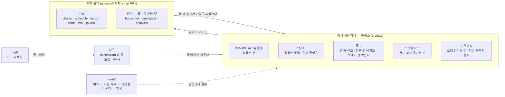

# crew-workspace

과제 비서 봇 **prodev** — 봇을 움직이는 **하네스**를 만들고(`prodev/`), 검수하고(`meta/`), 채팅 창구에 붙여 돌리는(`minidiscord/` + `projects/`) 자리 하나.

## 한눈에 — 하네스가 핵심이고, 채팅은 창구다

이 작업판에서 만든 것은 채팅 봇이 아니라 **비서 세션 하나를 움직이는 하네스**다. 지침 열한 줄 · 스킬 열다섯 · 훅 셋 · 스크립트 열 · 도우미 여섯이 그것이고, 전부 `prodev/` 에 있다.
채팅 서버(minidiscord)는 사람이 봇에게 말을 거는 **창구**일 뿐이다. 봇의 기억은 채팅이 아니라 **과제 폴더의 파일**에 있고, 창구를 바꿔 끼워도 하네스와 과제 폴더는 그대로다.



읽는 법은 셋이다.

- **왼쪽(창구)은 바꿔 끼울 수 있다.** 봇은 채팅 서버를 통해 말을 받을 뿐, 사실은 전부 과제 폴더에 파일로 남긴다. 세션이 꺼져도, 서버를 바꿔도 잊지 않는다.
- **가운데(하네스)가 이 작업판의 본체다.** "세는 것과 막는 것은 기계(훅 · 스크립트), 정하는 것은 지침, 일하는 방법은 스킬" — 지침은 짧게 두고 절차는 스킬과 훅이 진다. 무엇이 왜 이렇게 생겼는지는 `prodev/README.md` 가 그림으로 설명한다.
- **오른쪽(과제 폴더)은 사실과 방식으로 갈린다.** 카드 · 위키 · 일지는 **사실**이라 자동으로 쌓이고, `house.md`(규칙) · `templates/`(양식) · `analysis/`(방법)는 사람이 "앞으로"라고 했을 때만 **굳는다**. 이것이 v3 "쓸수록 맞아 가는 비서"의 자리다.

**지금 판**: prodev `design/v3` (ADR-031~037). 검수 기록은 `meta/prodev-review/runs/`, 가리키는 커밋은 `workspace.json`. 회사로 옮길 때는 `meta/prodev-review/HANDOFF.md` 와 `WINDOWS.md` 3-C 부터.

## 무엇이 어디에 있나

디스크에 있는 것과 채팅 서버 안에만 있는 것을 나눠서 본다. **방(room)은 폴더가 아니다.** 채팅 서버가 자기 DB 안에 두는 대화 창이고, 브라우저의 방 목록에만 보인다.

```
crew-workspace/                         ← 이 저장소
├── prodev/                             하네스 — 지침 · 스킬 15 · 훅 3 · 스크립트 10 · 도우미 6 · 설계 문서(design/v3)   (자기 저장소 bjw202/prodev)
│   ├── CLAUDE.md                       봇 지침 열한 줄
│   ├── .claude/skills/ · agents/       일하는 방법 · 도우미
│   ├── common/hooks/                   session-start · pre-compact · pre-reply
│   ├── scripts/setup.js                과제를 여는 명령 (나머지 스크립트는 봇의 손)
│   ├── docs/evidence/                  meta 판정 기록의 사본 (회사로 갈 때 이력이 끊겨서)
│   └── bots/
│       └── prodev-수율개선-bot/         과제 하나의 봇 설정. setup 이 만든다
│           ├── .claude/settings.json     훅 · 허용 목록
│           ├── .mcp.json                 채팅 서버 연결
│           ├── .env                      토큰 둘 (봇 · 알림 계정)
│           └── rooms.json                "내 방은 8번과 9번" 같은 방 번호표
├── projects/                           과제 자료 창고. 과제 하나 = 폴더 하나 = git 하나
│   └── 수율개선/                        setup 이 만든다. 봇이 여기에 쓴다
│       ├── charter.md · schedule.md      헌장 · 일정                      ┐
│       ├── inbox/                        사람이 올린 원본 (불변)           │ 사실 — 자동으로 쌓인다
│       ├── cards/                        실험 카드 (원본을 읽어 정리한 것)  │
│       ├── wiki/                         카드에서 자란 지식                │
│       ├── journal/ · research/ · report/ · paper/ · patent/             ┘
│       ├── house.md                      이 사람과 일하는 규칙 (상한 50줄)   ┐
│       ├── templates/                    가르친 양식                       │ 방식 — 사람이 "앞으로"라 했을 때만 굳는다
│       └── analysis/                     분석 한 건 = run.py + 여섯 칸 run.md + 카드 ┘
├── knowledge/                          회사 지식. 과제가 끝날 때 그 과제 wiki 에서 골라 올린 페이지 (PL 결재 뒤 봇의 close 스킬이 쓴다)
├── minidiscord/                        채팅 서버 코드                             (자기 저장소 bjw202/minidiscord)
│   └── data/
│       └── minidiscord.db              ★ 채팅 DB. 계정 · 봇 계정 · 방 · 글이 전부 여기
├── meta/                               검수 자리. 예측 · 정답지 · 대본 · 검수 기록 · 인수인계
├── crew/                               옛 실험(봇 다섯). 2026-09-09 닫음. 읽기만        (자기 저장소 bjw202/crew)
├── README.md · WINDOWS.md · workspace.json · bootstrap.sh · .gitignore · .gitattributes
```

채팅 서버 안(★ 그 DB 안)에만 있는 것:

```
minidiscord.db
├── 사람 계정        PL · 과제원들
│                    prodev-setup  (setup 이 봇을 등록하고 방을 만들 때 쓰는 사람 계정. 자동으로 생긴다)
│                    prodev-notify (봇이 꺼져 있을 때 대신 알림 글을 올리는 사람 계정. 자동으로 생긴다)
├── 봇 계정          prodev-수율개선-bot
└── 방 (room)        prodev-수율개선          ← 본방. 말은 여기서
                     prodev-수율개선/files    ← 파일은 여기에
```

한 과제를 열면 셋이 생긴다: 디스크에 **과제 폴더**(자료)와 **봇 설정 폴더**, 채팅 서버 안에 **방 둘**(대화). 방은 입구, 과제 폴더가 진실이다 — 사람이 방에 올린 파일을 봇이 과제 폴더에 카드로 정리한다.

| 폴더 | git |
|---|---|
| `meta/` · 루트 파일 여섯 · `projects/`(빈 폴더 표시만) | **이 저장소**(crew-workspace)가 담는다 |
| `prodev/` · `minidiscord/` · `crew/` | 각자 저장소. 이 저장소는 `workspace.json` 으로 커밋만 가리킨다 |
| `projects/수율개선/` 같은 과제 내용 | 각 과제가 자기 git. **여기에 올리지 않는다** (회사 자료) |
| `knowledge/` | 작은 저장소 (원격은 회사에서 정한다) |

규칙 하나: **prodev 를 고치는 사람은 prodev 안에서 브랜치 + PR 로, 검수하는 사람은 meta 에서.** 만드는 자리와 재는 자리를 나눈 것이 이 구조의 전부다.

## git 은 이렇게 한다

저장소를 합치지 않는다. 이 저장소(crew-workspace)는 `meta/` 와 목록 파일 `workspace.json` 만 담고, 나머지 셋은 **가리키기만** 한다. 목록 파일에는 "prodev 는 이 커밋, minidiscord 는 이 커밋"이 적혀 있다.

```
crew-workspace  (GitHub: bjw202/crew-workspace)
├── README.md · WINDOWS.md · workspace.json · bootstrap.sh · .gitignore · .gitattributes
├── meta/                ← 직접 담는다
├── prodev/              ← .gitignore. 자기 저장소 (bjw202/prodev)
├── minidiscord/         ← .gitignore. 자기 저장소 (bjw202/minidiscord)
├── crew/                ← .gitignore. 자기 저장소 (bjw202/crew)
└── projects/            ← .gitignore. 회사 자료
```

### 무엇이 필요한가 (기계 하나에 한 번)

**맥에서도 윈도우에서도 같은 코드를 쓴다.** 깔 것과 명령 꼴만 다르다.

| 무엇 | 왜 필요한가 | 없으면 |
|---|---|---|
| **Node ≥ 22** | 채팅 서버가 `node:sqlite` 를 쓴다 | 서버가 안 뜬다 |
| **npm** | Node 와 같이 온다 | — |
| **git** | 과제 폴더 하나 = git 저장소 하나 (ADR-003) | 이력이 안 남는다 |
| **python3** (3.11~3.13) | `peek.js` 의 xlsx · `plot.py` 의 그림 · `analysis/run.py` | xlsx · 그림 · 분석이 빠진다 |
| **python 꾸러미 여섯** | `openpyxl` `matplotlib` (봇용) · `pandas` `scipy` `statsmodels` (분석용) · `pdfplumber` (선택) | 아래 표 |
| **C++ 빌드 도구** | `better-sqlite3@13` 은 미리 빌드된 바이너리를 안 받고 소스 빌드한다 | `npm install` 이 죽는다 |
| **Claude Code** | 봇이 곧 Claude Code 세션이다 | 봇을 못 띄운다 |
| **유닉스 셸** (bash) | 봇의 Bash 도구 · `bootstrap.sh` · 상태줄 · Claude Code 가 훅을 돌리는 자리 | 아래 "왜 셸이 필요한가" |
| 인터넷 | 리서치 스킬 | 리서치만 빠진다 |

| 꾸러미가 없으면 | 무엇이 빠지나 |
|---|---|
| `openpyxl` | xlsx 를 못 연다 (csv 는 된다) |
| `matplotlib` | 그림만 안 그려진다 (죽지는 않는다) |
| `pandas` · `scipy` · `statsmodels` | `analysis` 스킬이 멈추고 "없다"고 말한다 |
| `pdfplumber` (선택) | pdf 글을 못 읽는다. `pdftotext` 가 있으면 그것을 쓴다 |

**꾸러미는 사람이 미리 깐다. 봇은 깔지 않는다** — 봇이 환경을 바꾸기 시작하면 무엇이 언제 바뀌었는지 아무도 모른다.

#### 맥 · 리눅스

```bash
# 맥 (Homebrew)
brew install node git python
pip3 install openpyxl matplotlib pandas scipy statsmodels pdfplumber
curl -fsSL https://claude.ai/install.sh | bash
```
C++ 빌드 도구는 Xcode Command Line Tools 다 (`xcode-select --install`). 대개 이미 있다.
셸은 이미 있다 — 기본 터미널에서 그대로 친다. **이 문서의 bash 칸만 보면 된다.**

#### 윈도우

셸을 **하나** 고른다. 둘 다 끝까지 밟아 봤고 둘 다 된다.

| | **WSL 2** | **Git Bash / PowerShell** (이 문서가 «윈도우» 라 부르는 쪽) |
|---|---|---|
| 한 줄 | 윈도우 안에 리눅스를 띄우고 작업판을 그 안에 둔다 | 윈도우에 그대로 두고 셸만 Git 이 주는 bash 를 쓴다 |
| 설정이 맥과 같나 | **같다.** 위 맥 칸을 그대로 따르면 끝 | 환경변수 문법과 경로가 다르다 (아래 '켜는 순서' 의 PowerShell 칸) |
| 회사 PC 정책 | 가상화(Hyper-V)를 막아 두면 못 쓴다 | 대개 막히지 않는다 |
| Claude Code 샌드박스 | 쓸 수 있다 | 쓸 수 없다 |

```powershell
# 관리자 PowerShell — Node MSI 는 기계 전체 설치라 관리자 권한이 필요하다
winget install OpenJS.NodeJS.LTS -e --accept-package-agreements --accept-source-agreements
winget install Python.Python.3.13 -e --accept-package-agreements --accept-source-agreements
winget install Git.Git -e --accept-package-agreements --accept-source-agreements
irm https://claude.ai/install.ps1 | iex
```
C++ 빌드 도구는 **Visual Studio Build Tools** 또는 VS Community + "Desktop development with C++".

그리고 윈도우만 하는 것 **셋**:

```powershell
# ① python3 라는 이름을 만든다 — 코드는 python3 를 부르는데 설치본은 python.exe 만 만든다.
#    별칭은 안 된다: 봇은 다른 PATH 로 떠서 별칭을 못 본다. 파일을 복사한다.
$p = "$env:LOCALAPPDATA\Programs\Python\Python313"
Copy-Item "$p\python.exe" "$p\python3.exe" -Force

# ② 파이썬 꾸러미
python -m pip install openpyxl matplotlib pandas scipy statsmodels pdfplumber

# ③ 줄끝을 건드리지 않게 못 박는다 (global 로 — 까닭은 WINDOWS.md 5.2)
git config --global core.autocrlf false
```

> **③ 을 왜 global 로 하나**: `setup.js --project` 는 과제 폴더마다 `git init` 을 한다.
> Git for Windows 의 system 기본값이 `core.autocrlf=true` 라, 그대로 두면 **새로 여는 과제마다**
> 봇이 쓰는 카드·위키·일지가 CRLF 가 된다. 저장소별 설정으로는 안 막힌다.

윈도우에서 처음 세우는 사람은 **[`WINDOWS.md`](WINDOWS.md) 를 옆에 둔다** — 무엇이 왜 막히는지,
막히면 어디를 보는지, 그리고 다 되었는지 재는 **확인표 스물**이 거기 있다.

#### 왜 셸(bash)이 필요한가

`bootstrap.sh` 하나 때문이 아니다. 셸을 지나는 자리가 넷이고 **넷 다 핵심 경로에 있다.**

| 자리 | 무엇이 셸을 쓰나 |
|---|---|
| 저장소 받기 | `bootstrap.sh` |
| **봇의 손** | 봇에게 허용된 Bash 명령 열 건 (`node` · `git` · `gh` · `python3` · `mkdir` · `ls` · `date` · `echo` · `pwd` · `cd`). `grep` 같은 유닉스 도구 스물하나는 v3 에서 뺐다 — 내장 `Read` · `Grep` · `Glob` 이 덮는다 |
| **훅 셋과 상태줄** | Claude Code 가 윈도우에서 훅 명령을 **bash 로** 돌린다. 이 자리가 조용히 깨지던 곳이다 (아래 "왜 이 꼴인가" ②) |
| meta 의 검수 도구 셋 | `gate-tests.sh` · `replay.sh` · `weekly.sh` (zsh — 윈도우에서는 안 돈다) |

### 처음 받을 때 (새 기계)

```bash
# 맥 · 리눅스 · WSL · Git Bash — 세 줄 같다
git clone https://github.com/bjw202/crew-workspace.git
cd crew-workspace
sh bootstrap.sh             # workspace.json 을 읽어 prodev · minidiscord · crew 를 적힌 커밋으로 받는다
```

**PowerShell 에서는 `bootstrap.sh` 가 안 돈다.** Git Bash 창에서 치거나, PowerShell 에서 한 줄로:
```powershell
& "C:\Program Files\Git\bin\bash.exe" -lc "cd '$((Get-Location).Path -replace '\\','/')' && sh bootstrap.sh"
```

**PowerShell 판 스크립트를 따로 두지 않는 것은 일부러다** — 사본을 두면 `workspace.json` 의 뜻이 두 군데로
갈라진다. 셸이 하나 있으면 받는 일은 끝이고, 그 뒤의 명령(서버 · setup · 봇)은 **PowerShell 에서도 그대로 돈다.**

#### 새 기계 첫날 한 번 — 작업판 신뢰(trust)

윈도우 전용이 아니다. **새 기계면 어디서나** 만난다. 승인 전이면 봇 세션 첫 줄에 이렇게 뜬다:

```
Ignoring 22 permissions.allow entries from .claude/settings.json: this workspace has not been trusted.
```

그러면 허용 목록이 **통째로 무시**돼 봇이 아무 파일도 못 쓴다. 봇 폴더에서 `claude` 를 한 번
대화형으로 켜 신뢰 물음에 «예» 하면 끝난다. (`~/.claude.json` 에 직접 넣을 수도 있다 — 키는
**슬래시 꼴**이고, 위 오류 메시지가 정확한 키를 알려 준다.)

### 평소
- prodev 를 고칠 때: `cd prodev` 에서 브랜치를 만들고 PR. 이 저장소는 모른다.
- minidiscord 를 고칠 때: `cd minidiscord` 에서 자기 방식대로. 이 저장소는 모른다.
- meta 가 검수를 끝냈을 때만: `workspace.json` 의 커밋을 올리고 `meta/` 기록과 함께 이 저장소에 커밋한다. 그래서 이 저장소의 이력 = "언제 어느 코드를 검수했나".

### 하지 않는 것
- `prodev/` `minidiscord/` `crew/` `projects/` 안의 파일을 이 저장소에 추가하지 않는다 (`.gitignore` 가 막는다).
- 토큰(`.env` · `runs/.tokens.env`) · 채팅 DB(`*.db`) · `node_modules` 를 올리지 않는다.

## 봇을 돌리는 법

### 먼저, 등장하는 것 넷

| 무엇 | 한 줄 | 어디 있나 |
|---|---|---|
| **채팅 서버** (minidiscord) | 사람과 봇이 글을 주고받는 곳. 카카오톡 서버 같은 것 | `minidiscord/` 가 켜 두는 프로세스. 자료는 `MINIDISCORD_DATA_DIR` 폴더에 쌓인다 |
| **과제 폴더** (project) | 과제 하나의 **자료 창고**. 원본 파일 · 실험 카드 · 위키 · 일지가 파일로 쌓이고 git 이 이력을 지킨다 | `projects/<과제>/` |
| **방** (room) | 과제 하나의 **대화 창구**. 채팅 서버 안에 있다. 과제마다 둘 — 본방(말) 과 `/files`(파일) | 채팅 서버 안. 파일로는 없다 |
| **봇** | 과제 하나를 맡는 Claude Code 세션. 방에서 듣고, 과제 폴더에 쓴다 | 세션의 설정은 `prodev/bots/<봇 이름>/` |

방과 과제 폴더의 관계: **방은 입구, 과제 폴더가 진실.** 사람이 방에 파일을 올리면 봇이 그것을 과제 폴더에 카드로 정리한다. 방을 지워도 과제 폴더는 남고, 과제 폴더를 옮겨도 방은 그대로다. 그래서 둘을 따로 만든다 — `setup.js --project` 는 과제 폴더와 봇 설정을, `setup.js rooms` 는 채팅 서버에 방 둘을 만든다.

### 켜는 순서 — 터미널 셋

**세 창을 켠다.** ①은 켜 두고, ②는 과제 하나에 한 번, ③은 과제마다 하나씩 켜 둔다.

> **맥과 윈도우는 «환경변수를 주는 문법» 만 다르다.** 값도 순서도 같다.
>
> | | 맥 · 리눅스 · WSL · Git Bash | 윈도우 PowerShell |
> |---|---|---|
> | 한 번 주고 명령 | `VAR=값 명령` | (한 줄로 못 한다 — 미리 정한다) |
> | 창에 정해 두기 | `export VAR=값` | `$env:VAR = "값"` |
> | 줄 잇기 | `\` | 백틱 `` ` `` |
> | 경로 | `/a/b` · `$PWD` | `C:/a/b` (슬래시로 줘도 된다 — 노드가 받는다) |
>
> PowerShell 에 bash 꼴을 치면 `MINIDISCORD_PORT=3000: The term … is not recognized` 가 난다.

**1. 채팅 서버** (`minidiscord/` 에서. 이 창은 켜 둔다)

```bash
# 맥 · 리눅스 · WSL · Git Bash
cd minidiscord
npm install                       # 첫 번째만 (C++ 도구 · python 이 있어야 한다)
npm run build -w channel          # channel/dist/index.js 가 생겨야 한다
MINIDISCORD_PORT=3000 \
MINIDISCORD_DATA_DIR=$PWD/data \
MINIDISCORD_BOT_FILES_DIR=$PWD/../projects \
  npx tsx server/src/index.ts
```
```powershell
# 윈도우 PowerShell
cd C:\…\crew-workspace\minidiscord
npm install
npm run build -w channel          # channel\dist\index.js 가 생겨야 한다
$env:MINIDISCORD_PORT = "3000"
$env:MINIDISCORD_DATA_DIR = "C:/…/crew-workspace/minidiscord/data"
$env:MINIDISCORD_BOT_FILES_DIR = "C:/…/crew-workspace/projects"
npx tsx server/src/index.ts
```

떴는지 확인 (다른 창에서):
```bash
curl -sS http://127.0.0.1:3000/api/health          # {"ok":true}
```
```powershell
Invoke-RestMethod http://127.0.0.1:3000/api/health  # ok : True
```

| 환경변수 | 뜻 | 값을 어떻게 정하나 |
|---|---|---|
| `MINIDISCORD_PORT` | 서버가 여는 포트. 브라우저 주소의 뒷자리 | 실전 3000. 시험은 다른 번호(예 3123) |
| `MINIDISCORD_DATA_DIR` | 채팅 DB(`minidiscord.db`)와 업로드 파일이 쌓이는 폴더. 없으면 서버가 만든다 | 실전 `./data`. 시험은 다른 폴더 — 포트만 바꾸면 같은 DB 를 쓰게 되니 **둘 다** 바꾼다 |
| `MINIDISCORD_BOT_FILES_DIR` | 봇이 방에 **첨부할 수 있는** 파일의 뿌리. 이 밖의 파일을 첨부하면 서버가 조용히 뺀다 | 과제 폴더들의 **부모** = `projects/` (절대 경로) |

브라우저에서 `http://127.0.0.1:3000` 을 열고 이름 하나로 들어간다 (비밀번호 없음. 처음 쓰는 이름이면 그 자리에서 계정이 생긴다). 사람 계정은 PL 과 과제원들이다.

**2. 과제 폴더 · 봇 설정 · 방 둘** (`prodev/` 에서. 과제 이름을 정한다 — 예 `수율개선`)

```bash
# 맥 · 리눅스 · WSL · Git Bash
cd prodev
export MINIDISCORD_URL=http://127.0.0.1:3000 \
       MINIDISCORD_DIR=$PWD/../minidiscord \
       MINIDISCORD_DB=$PWD/../minidiscord/data/minidiscord.db \
       MINIDISCORD_BOT_FILES_DIR=$PWD/../projects
node scripts/setup.js --project 수율개선
node scripts/setup.js rooms 수율개선
```
```powershell
# 윈도우 PowerShell
cd C:\…\crew-workspace\prodev
$env:MINIDISCORD_URL = "http://127.0.0.1:3000"
$env:MINIDISCORD_DIR = "C:/…/crew-workspace/minidiscord"
$env:MINIDISCORD_DB  = "C:/…/crew-workspace/minidiscord/data/minidiscord.db"
$env:MINIDISCORD_BOT_FILES_DIR = "C:/…/crew-workspace/projects"
node scripts/setup.js --project 수율개선
node scripts/setup.js rooms 수율개선
```

setup 의 마지막 줄 **`④ 환경 점검`** 에서 **"명령 15개 모두 풀림"** 이 나와야 한다.
하나라도 못 찾으면 그 줄이 이름을 대 준다 — 그대로 띄우면 **그 명령을 쓰는 일이 전부 막힌다**
(오류가 아니라 승인 창으로 나타나서 알아채기 어렵다).

> 윈도우에서 `setup.js` 는 **Git 의 유닉스 도구 자리를 스스로 찾아** 봇 PATH 앞에 넣는다.
> 그래서 PowerShell 기본 PATH 로 돌려도 열다섯이 다 풀린다 (실측). 창마다 PATH 를 손으로
> 고칠 일은 없다 — 사람이 그 창에서 직접 `ls` · `date` 를 치고 싶을 때만 `WINDOWS.md` 6.1 을 본다.

| 환경변수 | 뜻 | 값 |
|---|---|---|
| `MINIDISCORD_URL` | setup 이 봇을 등록하고 방을 만들 때 부르는 서버 주소 | 1단계의 포트와 같게 |
| `MINIDISCORD_DIR` | 채팅 서버 코드 폴더. 봇이 붙는 채널 플러그인이 여기 있다 | `minidiscord/` |
| `MINIDISCORD_DB` | 채팅 DB 파일. 봇의 훅이 "확정 글이 진짜 사람 글인가"를 확인할 때 **직접 읽는다** (쓰지 않는다) | 1단계 `DATA_DIR` 안의 `minidiscord.db` |
| `MINIDISCORD_BOT_FILES_DIR` | 1단계와 같은 값. `--project` 에 이름만 주면 **이 아래에** 과제 폴더를 만든다 | `projects/` |

두 명령이 만드는 것 — 첫째는 **디스크**에, 둘째는 **채팅 서버 안**에:

| 명령 | 디스크에 생기는 것 | 채팅 서버(DB) 안에 생기는 것 |
|---|---|---|
| `setup.js --project 수율개선` | ① `projects/수율개선/` (없으면 만들고 `git init`) · ③ `prodev/bots/prodev-수율개선-bot/` (봇 설정 폴더: 훅 · 허용 목록 · 서버 연결 · `.env`) | ② **봇 등록**: 채팅 서버에 봇 계정 `prodev-수율개선-bot` 을 만들고 받은 봇 토큰을 `.env` 에 적는다 · 알림 계정 `prodev-notify` 로 로그인해 그 토큰도 `.env` 에 적는다 |
| `setup.js rooms 수율개선` | `prodev/bots/prodev-수율개선-bot/rooms.json` (방 번호표 한 장) | **방 둘** `prodev-수율개선` (본방) · `prodev-수율개선/files` 를 만들고 봇을 둘 다 참여시킨다. 브라우저의 방 목록에 나타난다 |

> ### 토큰은 사람이 만지지 않는다
> 봇을 돌리는 데 필요한 토큰은 둘이고, **둘 다 setup 이 받아서 `.env` 에 스스로 적는다.**
>
> | 토큰 | 무엇 | 누가 받나 |
> |---|---|---|
> | `MINIDISCORD_TOKEN` | 봇 계정의 토큰. 봇 세션이 채팅 서버에 붙을 때 쓴다 | setup ② 가 봇을 등록하면서 받는다 |
> | `PRODEV_NOTIFY_TOKEN` | 알림 계정 `prodev-notify` 의 세션 쿠키. 봇이 꺼져 있을 때 훅이 글을 올릴 때 쓴다 | setup ② 가 그 계정으로 로그인하면서 받는다 |
>
> 사람이 브라우저에서 쿠키를 꺼내거나, 값을 복사해 붙이거나, `.env` 를 열어 고칠 일이 **없다.** `.env` 를 열어 보면 줄마다 무엇인지 풀이가 한 줄씩 있다.
> 조건은 하나 — **1단계의 채팅 서버가 켜져 있을 것.** 서버가 꺼진 채 setup 을 돌리면 폴더와 설정만 만들고 "서버 없음, 건너뜀"이라 말한 뒤 끝난다. 서버를 켜고 같은 명령을 한 번 더 돌리면 그때 등록하고 토큰을 받는다 (이미 된 것은 건드리지 않는다).
>
> 예외 하나: meta 가 검수 대본을 재생할 때 쓰는 PL · 과제원 토큰은 검수용이라 따로 있다 (`meta/prodev-review/HANDOFF.md`). 봇을 돌리는 것과는 무관하다.
>
> **채팅 서버 웹 화면의 "봇 등록" 버튼은 prodev 봇에 쓰지 않는다.** 그 화면이 시키는 일(봇 등록 · 토큰 · `.mcp.json` 만들기 · 방 참여)을 setup 이 전부 대신 한다. 웹에서 같은 이름으로 먼저 등록해 버리면 setup 이 "서버에 있는데 토큰이 없다"고 멈추니, 그때는 웹에서 그 봇을 지우고 setup 을 다시 돌린다. 그 화면은 crew 시절(봇 다섯)에 봇을 손으로 붙이던 것이고, 나중에 봇을 여럿 붙일 때 다시 쓴다. 지금은 열지 않으면 된다.

`rooms` 는 폴더를 만드는 명령이 아니다. 채팅 서버에 "이 과제의 대화 창 둘을 열어라"고 시키는 것이고, 디스크에는 방 번호를 적은 `rooms.json` 만 남는다.

봇 이름은 `prodev-<과제>-bot` 꼴로 setup 이 붙인다. 사람이 채팅에서 봇을 부를 때 이 이름을 쓴다: `@TO(prodev-수율개선-bot) …`.

`prodev-notify` 는 무엇인가. 봇이 켜져 있지 않은 순간에도 방에 글이 올라가야 할 때가 있다 — 봇의 기억이 압축되기 직전의 "정리 중입니다"와 직후의 "정리가 끝났습니다". 채팅 서버는 봇 글을 봇 세션을 통해서만 받으므로 이런 글은 **사람 계정 하나**가 대신 올린다. 그 계정이 `prodev-notify` 다(봇이 아니라 이름만 그런 사람 계정). setup 이 이 계정으로 한 번 로그인해 받은 세션 쿠키를 `.env` 의 `PRODEV_NOTIFY_TOKEN` 에 넣어 두고, 훅이 그것으로 글을 올린다. `.env` 를 열면 그 줄 위에 이 풀이가 한 줄 적혀 있다. 사람이 할 일은 없다 (서버가 꺼진 채 setup 을 돌렸다면 서버를 켜고 한 번 더 돌리면 받는다).

아침 브리핑과 저녁 일지를 **정해진 시각에 저절로 올리지는 않는다** (2026-09-11 결정 — cron 도 작업 스케줄러도 없다). "오늘 뭐 있지" · "정리해 둬" 라고 사람이 말을 걸 때 `brief` · `journal` 이 뜬다. 자리에 없을 때 쌓이는 브리핑보다 말을 걸 때 나오는 브리핑이 반드시 읽힌다.

**3. 봇 세션** (봇 폴더에서. 과제마다 하나 · 이 창도 켜 둔다)

```bash
# 맥 · 리눅스 · WSL · Git Bash — 줄 잇는 문자가 \
cd prodev/bots/prodev-수율개선-bot
claude --setting-sources project,local --strict-mcp-config --mcp-config .mcp.json \
       --dangerously-load-development-channels server:minidiscord-channel
```
```powershell
# 윈도우 PowerShell — 한 줄로 붙인다 (아래 상자를 읽을 것)
cd C:\…\crew-workspace\prodev\bots\prodev-수율개선-bot
claude --setting-sources project,local --strict-mcp-config --mcp-config .mcp.json --dangerously-load-development-channels server:minidiscord-channel
```

> **PowerShell 에서는 이 명령을 한 줄로 둔다.** 줄 잇는 문자(백틱 `` ` ``)로 끊어 적으면
> **붙여넣기에서 깨진다** — 백틱은 줄의 **맨 끝**이어야 하는데, 문서에서 복사하면 뒤에 공백이
> 하나 붙거나 콘솔이 두 줄을 따로 받아 이어쓰기가 풀린다. 그러면 `--mcp-config` 의 값이
> 명령 자리로 떨어져 **PowerShell 이 `.mcp.json` 을 «파일 열기» 로 처리한다** (연결된 프로그램이 뜬다).
> 2026-09-13 에 실제로 그렇게 걸렸다. 한 줄이면 안 생긴다.
>
> 길어서 거슬리면 배열로 나눈다 — 이 꼴은 붙여넣기에 안 깨진다:
> ```powershell
> $args = @(
>   '--setting-sources', 'project,local'
>   '--strict-mcp-config', '--mcp-config', '.mcp.json'
>   '--dangerously-load-development-channels', 'server:minidiscord-channel'
> )
> claude @args
> ```
> bash 쪽 `\` 는 붙여넣기에서 안 깨지므로 위 bash 칸은 여러 줄로 둔다.

**이 창은 사람이 직접 켠 대화형 창이어야 한다.** 파이프로 넘기거나 스크립트로 띄우면
Claude Code 가 `--print` 로 떨어져, 채널이 방의 글을 세션에 밀어 넣지 못한다 — 봇이 뜨긴 하는데
방에서 불러도 안 깨어난다.

띄운 뒤 **첫 줄을 본다.** 아래 둘이 없어야 한다:
- `SessionStart:startup hook error` → 훅이 죽었다. 봇은 멀쩡히 떠서 방에도 붙지만 **헌장·규칙을 안 싣고
  분량 검사·확정 관문·발송 결재가 안 걸린다.** 밖에서는 정상으로 보이는 고장이다
- `Ignoring N permissions.allow entries … not been trusted` → 작업판 신뢰를 아직 안 했다 (위 "새 기계 첫날")

| 조각 | 뜻 |
|---|---|
| 봇 폴더에서 켠다 | 훅 · 허용 목록 · 서버 연결이 전부 이 폴더의 설정에서 온다 |
| `--setting-sources project,local` | 이 PC 의 개인 설정을 봇에 섞지 않는다 |
| `--strict-mcp-config --mcp-config .mcp.json` | 이 파일에 적힌 채팅 서버 하나에만 붙는다 |
| `--dangerously-load-development-channels server:minidiscord-channel` | 채팅 서버와 세션을 잇는 채널 플러그인을 켠다 |

채팅에서 본방에 `@TO(prodev-수율개선-bot) 안녕` 하면 봇이 답한다.

사람이 외울 규칙은 한 줄: **말은 아무 데서나, 파일은 files 에.**

더 자세한 것(문제가 날 때 · 왜 이렇게 됐나 · 다른 기계로 옮길 때)은 `prodev/docs/launch.md`. 검수 쪽 인수인계는 `meta/prodev-review/HANDOFF.md`.

### 시험할 때는 창구 없이 돌린다
하네스만 시험할 때는 채팅 서버를 아예 띄우지 않는다 (`prodev/docs/launch.md` 11절). `setup.js --project` 는 서버 없이도 돌고, 봇은 `claude --setting-sources project,local` 로 켠다 — 검수 세션(meta)이 사람 역할로 말을 건넨다. 이때 **`MINIDISCORD_DB` 를 없는 경로로** 준다. 안 주면 살아 있는 채팅 DB 를 기본값으로 잡는다. 검수 판은 prodev 를 `git archive` 로 뜬 **사본**에서 돌려 형제 봇 폴더를 못 보게 한다.

창구까지 시험할 때만 서버를 따로 띄운다 — 살아 있는 방을 건드리지 않으려고 **포트와 데이터 폴더를 둘 다** 바꾼다. 예: `MINIDISCORD_PORT=3123 MINIDISCORD_DATA_DIR=testplace/data2`. 2단계의 `MINIDISCORD_URL` 과 `MINIDISCORD_DB` 도 그에 맞춘다. 채널이 있어야만 재는 것 셋(분량 검사 · 카드 확정 관문 · 발송 결재)이 이 판의 몫이다.

---

## 잘 안 될 때 — 증상에서 자리 찾기

**대부분의 고장은 오류를 내지 않는다.** 그래서 "봇이 떴다"를 성공으로 치면 안 된다.
아래 왼쪽 칸은 **밖에서 보이는 모습**이고, 오른쪽이 실제 자리다.

| 증상 | 어디 |
|---|---|
| `MINIDISCORD_PORT=3000: The term … is not recognized` | PowerShell 에 bash 꼴을 쳤다. `$env:이름 = "값"` |
| `npm error gyp ERR! find Python` | C++ 도구 · python 이 없다 (준비물). 깐 뒤 `npm install` 다시 |
| `npm install` 이 `1603` · `1618` 로 죽는다 (윈도우 Node MSI) | 관리자 권한이 없거나 멈춘 `msiexec` 가 물려 있다. 재부팅이 가장 빠르다 |
| `Error: statement has been finalized` | Node 22 + 옛 `chat.js`. 지금은 고쳐져 있다 — 안 고쳐졌으면 `prodev` 를 최신으로 |
| `Ignoring N permissions.allow entries … not been trusted` | 작업판 신뢰를 안 했다 (준비물의 "새 기계 첫날") |
| `SessionStart:startup hook error` · `cjs/loader` | 훅 명령이 셸에서 깨졌다. 봇 설정의 훅 셋에 **역슬래시가 있으면** 이 자리다 (아래 ②) |
| 봇이 말은 하는데 **파일을 하나도 안 만든다** | 권한 패턴이 안 맞는다. 봇 설정의 허용 패턴이 `(//C:/…` 로 시작하면 이 자리다 (아래 ①). 또는 신뢰 미승인 |
| 봇이 `ls` · `mkdir` · `date` 를 못 찾거나 승인을 묻는다 | 봇 PATH 에 유닉스 도구 자리가 없다. `setup.js` 를 다시 돌리고 `④ 환경 점검` 을 본다 |
| 봇 답·알림의 한글이 `????` | 윈도우에서 `curl` 을 지나는 자리가 남아 있다 (아래 ⑤). 지금은 `fetch` 로 바뀌어 안 생긴다 |
| 그림 경로 · xlsx 요약의 한글이 깨진다 | 파이썬 stdout 인코딩 (아래 ⑥) |
| 스킬 머리말을 못 찾는다 · `'…\r' !== '…'` | 줄끝이 CRLF 다. `git config --global core.autocrlf false` 뒤 저장소를 다시 쓴다 |
| **봇이 카드에 첨부했는데 방에 안 보인다** | 첨부 뿌리(`MINIDISCORD_BOT_FILES_DIR`)가 과제 폴더들의 **부모** 가 아니다. 드라이브 문자 대소문자는 이제 상관없다 (아래 ⑦) |
| 봇은 뜨는데 방에 답이 없다 | 서버 포트 · `MINIDISCORD_URL` · `.mcp.json` 셋이 어긋났다. 셋을 같게 |
| 봇이 뜨는데 방에서 불러도 **안 깨어난다** | ③ 을 대화형 창이 아닌 데서 띄웠다 (`--print` 로 떨어진다) |
| `spawn npx ENOENT` · `서버가 뜨기 전에 죽었다 (exit -4058)` | 윈도우에 실행 가능한 `npx` 가 없다. 지금은 고쳐져 있다 (아래 ⑨) |

이미 세운 판이 **정말 성한지** 재려면 [`WINDOWS.md`](WINDOWS.md) 7절의 **확인표 스물**을 위에서부터 친다.
시험 숫자 기준선: minidiscord **293+103 통과**, prodev **133 통과**, prodev 서버 시험 **24 통과·1 건너뜀**,
e2e **15/15** 와 **20/20**.

---

## 왜 이 꼴인가 — 윈도우와 맥을 한 코드로 두기까지 (2026-09-13)

이 작업판은 맥에서 만들어졌다. 2026-09-12~13 에 윈도우 11 로 옮겨 **채팅 서버 · 봇 · 방 · 첨부까지
끝까지 밟았다.** 그 과정이 코드와 이 문서의 지금 모습을 정했으므로 적어 둔다.

### 결론부터 — **솔루션은 하나다**

코드는 한 벌이고, **플랫폼을 가르는 자리는 넷뿐**이다. 넷 다 OS 가 실제로 다른 자리이고,
**posix 쪽 값은 한 바이트도 안 바뀌었다.**

| 가른 자리 | 맥 · 리눅스 | 윈도우 |
|---|---|---|
| `setup.js` 의 `pat()` — 권한 패턴 | `'//' + 경로` (예전 그대로) | `//` 를 안 붙인다 — 붙이면 한 건도 안 맞는다 |
| `setup.js` 의 `FIRST_DIRS` — 봇 PATH 앞자리 | **빈 목록** (아무것도 안 바뀐다) | Git 의 유닉스 도구 자리 둘 |
| `gateway.ts` 의 `뿌리안()` — 첨부 뿌리 판정 | 대소문자 **구분** (예전 그대로) | 무시 — 윈도우 파일 이름이 실제로 그렇다 |
| `e2e-lib.mts` 의 `stopServer` | 프로세스 그룹 `-pid` (예전 그대로) | 자식 하나 `child.kill` — 그룹 신호가 없다 |

**모두에게 달라진 줄은 셋**뿐이고, 셋 다 플랫폼 공통으로 더 튼튼해진 것이다:
방 알림이 `curl` → `fetch`(바깥 명령 의존 하나 없앰) · 시험 서버가 `npx` → tsx CLI 직접(자식 하나) ·
시험이 SQLite 핸들을 닫는다(**맥에서는 조용히 새고 있었다**).

**사람이 보는 쪽만 둘이다** — 환경변수 문법과 경로 꼴. 그래서 이 문서가 명령을 두 벌 싣는다.

### 막힌 자리 열둘, 그중 **아홉이 오류를 안 냈다**

| # | 무엇이 망가졌나 | 밖에서 보이던 모습 | 오류 났나 |
|---|---|---|---|
| ① | 권한 패턴이 `//C:/…` 꼴이라 한 건도 안 맞음 | 봇이 말은 하는데 **파일을 하나도 못 만든다** | 아니 |
| ② | 훅 명령이 역슬래시라 **bash 가 escape 로 먹음** (`C:\a\b` → `C:ab`) | 세션이 멀쩡히 뜨고 방에도 붙는데 **헌장·규칙을 안 싣고 분량 검사·확정 관문·발송 결재가 안 걸린다** | 첫 줄에만 |
| ③ | 봇 PATH 에 Git 유닉스 도구 자리가 없음 | 봇이 `ls`·`mkdir`·`date` 를 못 찾아 **승인 창**이 뜬다 | 아니 |
| ④ | 환경 점검이 윈도우에서 `git`·`node` **둘만** 봄 | `grep` 이 없어도 "명령 2개 모두 풀림" 이라고 **초록으로** 지나간다 | 아니 (거짓 초록) |
| ⑤ | 방 알림이 `curl` 을 부름 | 알림의 한글이 `????` 로 올라간다 | 아니 |
| ⑥ | 파이썬 stdout 이 콘솔 코드페이지 | xlsx 요약·그림 경로가 **깨진 채 카드에 들어간다** | 아니 |
| ⑦ | 서버가 첨부 뿌리를 대소문자까지 맞춰 비교 | 뿌리를 `c:/…`(소문자)로 주면 **봇 첨부가 전부 조용히 사라진다** | 아니 |
| ⑧ | `chat.js` 가 준비된 문장을 안 붙잡음 | Node 22 에서 **대화 검색이 통째로 못 돈다** | 났다 |
| ⑨ | 시험·러너가 `spawn('npx', …)` | 윈도우에 실행 가능한 `npx` 가 없다 → 서버 시험 25건 중 **17건이 안 돌았다** | 났다 |
| ⑩ | e2e 종료가 프로세스 그룹 신호 | 러너가 안 끝난다 | 아니 |
| ⑪ | 시험 둘이 **열린 SQLite 핸들 위에서** 폴더를 지움 | 윈도우는 열린 파일을 못 지운다 → sse 시험 아홉이 붉는다. **맥에서는 조용히 새고 있었다** | 났다 |
| ⑫ | 시험 하나가 `startsWith('/')` 로 «절대 경로인가» 를 쟀다 | `C:\…` 에서 틀린다 | 났다 |

곁들여 윈도우와 **무관한** 결함 하나도 나왔다: `session-start` 훅이 일지 날짜는 **로컬 달력**으로
짓고 «며칠 전» 은 **UTC 자정** 기준으로 세서, 한국(UTC+9)에서 **자정~오전 9시에 하루 어긋났다.**
봇이 켜질 때마다 싣는 「며칠 비었나」가 그 시간대에 틀렸다는 뜻이다. 손대지 않은 원본에서도
같이 붉는 것을 확인하고 따로 고쳤다.

### 여기서 나온 규칙 — **값마다 «누가 읽는가» 가 다르다**

②가 가장 비싼 자리였다. 같은 설정 파일 안의 값들이 서로 **다른 읽는 이**를 갖는데,
그걸 한 꼴로 써서 셋이 조용히 죽었다. 지금은 이렇게 가른다:

| 값 | 읽는 쪽 | 꼴 |
|---|---|---|
| `hooks[].command` · `statusLine.command` | **셸 (bash)** | 슬래시 (`C:/a/b`) — 역슬래시는 escape 로 먹힌다 |
| `permissions.allow` / `deny` | Claude Code 패턴 대조기 | 슬래시, `//` 없이 |
| `env.*` · `additionalDirectories` | Claude Code · 자식 프로세스 | **실제 경로** (역슬래시 그대로) |

그리고 **왜 시험 133건이 이걸 못 잡았나** — 시험은 훅을 `node` 로 **직접** 부른다.
실전은 Claude Code 가 **셸을 거쳐** 부른다. 그 사이의 escape 규칙이 시험 경로에 아예 없었다.
그래서 확인표에 「훅을 **bash 로 한 번 거쳐** 돌려 본다」 칸을 넣었다 (`WINDOWS.md` 7절 15).

교훈 하나 더: **갈래를 일부만 판 것이 안 판 것보다 나쁘다.** `setup.js` 에는 이미 win32 갈래가
셋 있었고(`STD_DIRS` · `NEEDED` · `exts`) `pat()` 만 없었다. 앞의 셋이 "윈도우를 본 코드" 라는
인상을 주어 나머지를 안 보게 했다.

### 앞 문서의 진단 둘이 틀렸다 — 고쳐 뒀다

먼저 밟은 세션이 "MSYS 셸이 한글 인자를 ANSI 코드페이지로 떨어뜨린다"고 적었다. **아니다.**
갈리는 것은 셸이 아니라 **그 실행 파일이 argv 를 ANSI 로 읽는가**다 — `System32\curl.exe` 는
멀쩡하고 Git 의 `mingw64\bin\curl.exe` 는 깨지는데, **셸을 거치든 노드가 직접 부르든 같다.**
`python3` 와 `node` 는 둘 다 멀쩡하다.

이 틀린 진단이 **고칠 수 없는 자리**(시스템 코드페이지)를 가리켜 **고칠 수 있는 자리**를 가렸다.
진짜 결함은 «어느 `curl` 이 잡히는지를 사람이 못 고른다» 는 것이었다 — 같은 창에서 `curl` 은
System32 인데 `npm test` 안에서는 mingw 이 잡혔다(npm 이 PATH 를 다시 짠다).
**PATH 순서가 방에 올라가는 글자를 바꾸고 있었다.** 그래서 PATH 순서를 문서로 지키는 대신
알림 경로에서 curl 을 **뺐다.** 이제 이 작업판은 `curl` 을 한 번도 부르지 않는다.

같은 문서가 "윈도우에서 시험 133 통과 · 실패 0" 이라 적었는데 그것도 아니었다 — 셋이 실패한 채
통과로 적혀 있었다. 자세한 대조는 `WINDOWS.md` 5.3 과 `meta/prodev-review/runs/2026-09-13-windows-port.md`.

### 아직 안 잰 것 (솔직하게)

| 무엇 | 왜 |
|---|---|
| **맥 회귀** | 옮긴 기계에 맥이 없었다. 코드를 읽어 posix 결과가 같음만 확인했다. 맥에서 시험 넷을 한 번 돌리는 것이 «두 환경 다 된다» 의 마지막 근거다 |
| ~~봇이 방의 글에 스스로 깨어나는 것~~ | **2026-09-13 에 사람이 창에서 켜 확인했다.** 채널이 붙고 방에서 부르면 봇이 깨어난다. 도구로는 잴 수 없던 자리다(TTY 가 필요해 `--print` 로 떨어진다) |
| **Node 22 에서 `chat.js`** | 그 기계에 22 가 없었다. 24 에서만 확인 |
| 심볼릭 링크 보안 경계 두 칸 | 윈도우가 개발자 모드 없이 `symlinkSync` 를 막는다. 한 칸은 링크 부분만 빼고 재고, 한 칸은 «건너뜀» 으로 남긴다 — 통과로 위장하지 않았다 |
| 경로에 **공백** | 훅 명령에 따옴표가 없어 ② 가 다시 깨진다. `C:\project\…` 처럼 공백 없는 자리에 둔다 |
| meta 의 zsh 도구 셋 | 윈도우에 zsh 이 없다. node 로 옮기는 것이 옳은 방향 |
