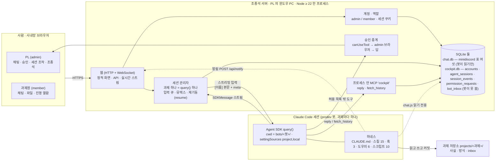

# 웹 조종석 — 실제 Claude Code 세션(prodev)을 단일 웹 앱으로 감싼다 (설계 검토, 2026-09-14)

이 문서는 meta 가 쓴 **설계 검토**다. 만들지 않는다. 제작은 다음 회차에 새 저장소에서 worktree + PR 로 한다.
먼저 읽을 것은 `AS-IS-TO-BE.md`(지금 → 앞으로, 한 장). 같은 폴더의 `TASKS.md`(태스크 분할 · 관문) · `PREDICTIONS.md`(예측표) · `spike/RESULTS.md`(이 맥에서 직접 돌린 실증 다섯 묶음) · `research/`(조사 둘 + 검토 기록)가 근거다.

검토 이력: 2026-09-14 별도 opus 세션의 적대 검토 두 판(`research/design-review-1.md`, 조건부 승인 · 지적 29). 막힘 다섯과 중요 열넷을 이 판에 반영했고, 그중 실험으로 닫은 것(조합 전체 · 대조군 · 훅+allowedTools · 도우미 agentID · SDK=CLI 판정)은 `spike/RESULTS.md` 실증 4 · 5 에 있다. 남은 조건은 전부 W1(회사 PC) 항목이다.

## 0. 쉬운 말 요약

회사가 Claude Code 의 **channels**(채팅 서버가 세션을 깨우는 통로)를 막아, 지금의 "minidiscord 방 + 채널 플러그인" 창구는 회사에서 못 쓴다. 대신 **웹 앱 하나가 실제 Claude Code 세션을 직접 붙들고**, 사람은 브라우저로 그 웹 앱에 들어와 봇과 말하고 봇이 일하는 과정을 본다. 세션은 단발 요청이 아니라 **계속 살아 있는 하나**다. 문맥이 쌓이고, 압축되고, 훅 · 스킬 · 서브에이전트가 지금과 똑같이 돈다.

이것이 되는지 이 맥에서 실제로 돌려 봤다(`spike/RESULTS.md`). Agent SDK 로 띄운 세션에 prodev 하네스(훅 셋 · 스킬 열다섯 · 도우미 여섯)가 그대로 실렸고, 채팅 서버 없이 프로세스 안에 만든 `reply` 도구를 봇이 불렀으며, 그 도구에 pre-reply 훅이 걸렸고, 세션 하나를 살려 둔 채 `/compact` 를 넣으니 압축 앞뒤 훅이 돌고 봇이 "이어서 합니다" 로 이었다.

선택은 **Agent SDK 조종석**(B안)이다. 터미널을 그대로 웹에 띄우는 길(A안, ttyd 류)은 가장 단순하고 하네스 충실도도 100% 지만, 사람 구분 · 역할별 승인 · 대화 저장소가 **구조적으로** 안 생겨 "다른 사람도 들어온다"는 목표에 못 닿는다. 단발 headless(E안)는 사람이 기각했고 R0 에 어긋난다.

착수 전에 사람이 정할 것은 셋이다(11절): ① 회사 계정(Team/Enterprise 좌석)에서 SDK 세션이 도는지와 **한 좌석을 과제원 여럿이 봇을 통해 쓰는 것**이 회사 계약상 괜찮은지 ② 새 저장소 이름 ③ 사내망 HTTPS 를 어떻게 할지.

## 1. 요구 — 사람이 정한 것 (2026-09-14)

| # | 요구 | 출처 |
|---|---|---|
| R0 | **살아 있는 세션.** 요청 하나에 세션 하나(단발 headless)는 기각. 문맥 · 압축 · 훅 · 스킬 · 서브에이전트 · 되감기가 실제 Claude Code 와 같아야 한다 | 사람, 이 세션 |
| R1 | 막힌 것은 channels 뿐. `claude -p` · SDK · MCP 는 회사 PC 에서 도는 것을 사람이 확인했다 | 사람 |
| R2 | 첫 판은 **세션 조종석**(Cowork · Aside 식): 채팅 + 도구 호출 · 서브에이전트 · 권한 승인 · 비용 · 파일 열람 | 사람 |
| R3 | minidiscord 는 **새 단일 웹 앱으로 대체**한다. 확장하지 않는다 | 사람 |
| R4 | PL 의 회사 윈도우 PC(PowerShell + Git Bash, WSL 없음)에 띄우고 사내망 브라우저로 접속. Claude Code 로그인은 PL 계정 하나 | 사람 |
| R5 | 세션 범위는 prodev 우선(과제 하나 = 봇 세션 하나, 탭으로 여럿). 범용은 "cwd + 설정" 추상만 열어 둔다 | 사람 |
| R6 | 역할 둘. admin(PL)만 권한 승인 · 세션 조작(끄기 · 압축 · 되감기). member(과제원)는 채팅 · 파일 · 진행 열람 | 사람 |
| R7 | 하네스(prodev)는 최소로만 고친다. 봇의 기억은 여전히 과제 폴더의 파일이고 창구만 바뀐다 | `../../../README.md` "창구는 바꿔 끼울 수 있다" |
| R8 | 회사 정책 안에서 논다. 막히면 우회하지 않는다 | `../../CLAUDE.md` |

## 2. 사실 — 근거가 있는 것만

### 2.1 이 맥에서 직접 확인한 것 (`spike/RESULTS.md`)

- SDK `query()` + `settingSources: ['project','local']` + cwd = 봇 폴더 → SessionStart 명령 훅 · 스킬 · 도우미가 실린다.
- `createSdkMcpServer` 로 프로세스 안에 만든 `reply` 도구를 봇이 부르고, 봇 설정의 **PreToolUse 명령 훅이 그 도구에 걸린다.** 훅 stdin 에 `tool_name · tool_input.{chat_id,text} · session_id · transcript_path · cwd` 가 온다 — `pre-reply.js` 가 읽는 칸 전부.
- 스트리밍 입력(`prompt: AsyncIterable`)으로 세션 하나에 말 셋을 차례로 넣을 수 있고, `/compact` 를 사용자 메시지로 넣으면 압축된다(`compact_boundary`, 23,482 → 2,424 토큰). PreCompact 훅과 SessionStart(compact) 훅이 돈다.
- 인증: API 키 없이 claude.ai 로그인(이 맥은 Max)으로 돌았다. `account.subscriptionType` 이 응답에 온다.
- 걸림 둘: `options.env` 는 덮어쓰기(`{...process.env, …}` 로 줘야 로그인이 산다) · `persistSession: false` 면 pre-compact 가 기록 파일을 못 읽는다(조종석은 기본값 `true` 로 둔다).

### 2.2 SDK 타입 정의에서 읽은 것 (`@anthropic-ai/claude-agent-sdk` 0.3.270, `sdk.d.ts`)

| 무엇 | 사실 |
|---|---|
| 권한 콜백 | `canUseTool(toolName, input, {signal, suggestions}) => Promise<PermissionResult>`. **비동기다.** 웹의 승인 버튼을 기다릴 수 있다. `updatedPermissions` 로 "이번 세션 동안 허용" 을 돌려줄 수 있다 |
| 권한 모드 | `'default' \| 'acceptEdits' \| 'bypassPermissions' \| 'plan' \| 'dontAsk' \| 'auto'`. 도중에 `setPermissionMode()` 로 바꾼다. 타입이 명시하는 것: `permissionPrompts: 'none'` 이면 콜백이 안 불리고 조용히 거부된다(실증 4d) — 조종석은 기본값 `'host'` 를 그대로 둔다. "`bypassPermissions` 에서는 콜백이 건너뛰어진다" 는 선행 사례 소스 주석뿐이라 **미실증**으로 둔다 |
| 훅 | 사건 33종. `PreCompact` 입력에 `trigger: 'manual' \| 'auto'`. 설정 파일의 명령 훅과 SDK 콜백 훅이 **같이** 돈다(실증 2) |
| 세션 조작 | `interrupt()` · `setModel()` · `supportedCommands()` · `supportedAgents()` · `mcpServerStatus()` · `accountInfo()` · `stopTask()` · `backgroundTasks()` · `streamInput()` · `close()` |
| 이어 켜기 | `resume: <session_id>` · `forkSession` · `continue`. `listSessions()` · `getSessionMessages()` 로 지난 기록을 읽는다 |
| 되감기 | `enableFileCheckpointing` + `rewindFiles(userMessageId)` — 파일만 되감는다 |
| 메시지 종류 | `assistant · user · result · system(init · compact_boundary · hook_started · hook_response · status …) · stream_event(부분) · task_started/updated/progress/notification · background_tasks_changed · permission_denied · rate_limit_event · auth_status` — 조종석 화면의 재료가 전부 여기 있다 |
| 값 | `result.total_cost_usd · usage · modelUsage · num_turns · duration_ms` (클라이언트 추정치. 청구액이 아니다) |
| 인증 종류 | `apiKeySource: 'ANTHROPIC_API_KEY' \| 'apiKeyHelper' \| '/login managed key' \| 'none'(= claude.ai OAuth)`. 오류에 `oauth_org_not_allowed` 가 있다 — 조직 정책이 막을 수 있는 자리 |
| CLI 바이너리 | SDK 는 플랫폼별 CLI 를 **자기 패키지에 동봉**한다(`@anthropic-ai/claude-agent-sdk-win32-x64` 등). `pathToClaudeCodeExecutable` 로 회사 PC 에 깔린 `claude` 를 쓰게 할 수 있다. 윈도우에서는 **반드시 명시**한다(`research/prior-art.md` 5-2) |

### 2.3 선행 사례에서 배운 것 (`research/prior-art.md`)

- "Aside" 는 서로 다른 두 제품이고 **둘 다 Claude Code 를 구동하지 않는다.** 참고 대상이 아니다. 맥 메뉴바 앱 쪽의 "세션 JSONL 을 읽어 목록 · 비용을 만든다" 기법만 가져온다.
- Cowork 는 에이전트 루프를 네이티브로, 코드 실행을 격리 VM 에서 돌린다. 공개된 것은 거기까지다.
- 가장 큰 오픈소스 셋: claudecodeui(13.7k★, **SDK 직접 호출**, `canUseTool` → WebSocket 승인) · vibe-kanban(28k★, headless stream-json, **비문서 플래그** `--permission-prompt-tool=stdio` 에 의존) · happy(23.8k★, 로컬 TUI 와 SDK 원격 모드를 오간다 — "터미널 화면 전송으로는 모바일 UI 를 못 만든다"의 실증).
- **자체 호스팅 다중 사용자를 하는 오픈소스는 없다.** claudecodeui 소스에 "This is a single-user system" 이 박혀 있다. 우리가 처음 설계한다.
- claudecodeui 소스 주석: `auto`/`bypassPermissions` 모드에서는 **`canUseTool` 이 건너뛰어진다**(권한 모드 단계에서 끝난다). 승인 화면을 살리려면 `default` 모드 + 허용 목록이어야 한다.
- 공식 Remote Control 은 기능적으로 가장 가깝지만 트랜스크립트가 Anthropic 서버에 저장되고 Team/Enterprise 는 기본 꺼짐 · `disableRemoteControl` 로 끌 수 있다. 사내망 자체 호스팅 요구(R4)와 맞지 않는다.
- Agent SDK 문서: "Anthropic does not allow third party developers to offer claude.ai login … for their products". 제품명에 "Claude Code" 를 못 쓴다.

### 2.4 지금 하네스가 채팅 창구에 기대는 것 (`research/coupling-inventory.md`)

채널 플러그인 자체에 묶인 것은 **둘뿐**이다: 훅 matcher 의 도구 이름 `mcp__minidiscord-channel__reply`, 그리고 세션에 들어오는 봉투 메타(`chat_id · message_id · delivery · sender · author_type · room_name`). 나머지는 minidiscord **서버**의 HTTP/SQLite 계약에 묶여 있다 — `chat.js`(find.js 6층 · journal · pre-reply 의 확정 조건)가 읽는 DB 표, `pre-compact.js`/`session-start.js` 의 알림(쿠키 + multipart), `intake-copy.js` 의 첨부 경로 뿌리, `setup.js` 의 봇 등록 · 방 만들기, `replay.js` 의 재생 API. 자세한 파일:줄은 결합 재고 문서 B절.

세션이 받는 글의 꼴(재현 대상):
```
[<이름>] <본문>(첨부 파일 경로: <경로>, …)
→ delivery="to"로 받은 메시지에는 반드시 reply 도구로 답변하세요.
meta: { chat_id(방 번호), message_id, delivery: to|cc, sender, author_type, room_name }
```
도구 둘: `reply(chat_id?, text, files?)` · `fetch_history(chat_id?, since_id?, since?, until?, speaker?, limit?)`. 절단 상한: 본문 4000B · 첨부 20 · 이력 16000B.

## 3. 방식 비교

| | A · 터미널 감싸기 (ttyd/xterm.js + tmux) | **B · Agent SDK 조종석** | C · headless stream-json 직접 | D · Remote Control (공식) | E · 단발 headless |
|---|---|---|---|---|---|
| R0 살아 있는 세션 | ○ TUI 그대로 | ○ 스트리밍 입력 (실증 3) | ○ `--input-format stream-json` | ○ | **✗ 기각** |
| 훅 · 스킬 · 도우미 · MCP | ○ 100% | ○ (실증 1 · 2) | ○ | ○ | △ |
| 압축 (자동 · 수동) + 훅 | ○ | ○ (실증 3) | ○ | ○ | ✗ |
| 권한 승인을 웹에서 | ✗ 화면 글자뿐 | ○ `canUseTool` (비동기) | △ `control_request` 비문서 | ○ (앱) | — |
| 사람 구분 (누가 말했나) | ✗ (wetty 면 OS 계정) | ○ 앱이 안다 | ○ | ✗ 한 계정 | — |
| 역할별 승인 (R6) | ✗ | ○ | ○ | ✗ | — |
| 대화 저장소 (find.js 6층) | ✗ | ○ 앱 DB | ○ | ✗ | — |
| 첨부 · 붙여넣기 | △ 터치에서 깨짐 | ○ | ○ | ○ | — |
| 사내망 자체 호스팅 (R4) | ○ | ○ | ○ | **✗** 트랜스크립트가 밖으로 | ○ |
| 윈도우 | △ ttyd ConPTY 됨, **tmux 없음** | ○ (`pathToClaudeCodeExecutable` 명시) | ○ (CLI ≥ 2.1.211) | ○ | ○ |
| statusline · `/login` | ○ | ✗ 조종석이 대신 그린다 · `/login` 은 PC 에서 한 번 | ✗ | — | — |
| 견고성 | 낮음 (ANSI 파싱) | 높음 (타입 있는 메시지) | 중간 (비문서 의존) | 높음 | — |
| 만드는 비용 | 하루 | 중간 | 중간~높음 | 0 | — |
| 목표 UI (R2) 도달 | **낮음** | **높음** | 높음 | — | — |

**판정: B.** 이유 셋.
1. R0 · R2 · R6 을 동시에 채우는 것은 B 와 C 뿐이고, C 의 승인 경로는 비문서 플래그에 선다. B 는 공식 타입이 있는 API 다(2.2). vibe-kanban 이 C 로 28k★ 를 얻은 것은 그쪽이 승인을 거의 안 쓰는 칸반이라서다.
2. A 는 "지금 당장 혼자 쓰기"에는 최고지만, 사람 구분 · 승인 게이트 · 대화 저장소는 **나중에 얹는 기능이 아니라 구조**다. 한 번 "이미 되는데" 가 나오면 목표가 영영 안 나온다(선행 사례 조사의 경고). 게다가 회사 PC 는 tmux 가 없어 A 의 최대 장점(재접속)이 편법 위에 선다.
3. B 는 이미 실증했다(`spike/RESULTS.md`). 남은 미지수는 회사 계정 하나뿐이다(W1 관문).

**A 를 0단계 발판으로 두지 않는다.** PL 혼자 쓸 것이면 회사 PC 의 터미널에서 `claude` 를 치면 된다. 웹 터미널이 더하는 것은 원격 접속뿐인데, R4 에서 접속은 사내망 브라우저이고 PL PC 가 곧 서버라 이득이 작다. 발판이 굳는 위험이 이득보다 크다.

## 4. 구성 — 한 장 그림



읽는 법. 조종석 서버 **하나**가 브라우저 여럿과 Claude Code 세션 여럿(과제마다 하나) 사이에 선다. 브라우저는 세션에 직접 닿지 않는다 — SDK 세션의 클라이언트는 언제나 서버 하나다(다중 접속 경쟁을 구조로 없앤다). 봇이 방에 말하는 길은 지금처럼 `reply` 도구이고, 그 도구가 서버 프로세스 안에 있어 훅이 그대로 걸린다. 하네스가 대화를 읽는 길(`chat.js`)과 알리는 길(훅의 알림)은 서버의 DB 와 HTTP 로 옮긴다.

### 4.1 부품 여섯

| 부품 | 하는 것 | 정한 것 · 근거 |
|---|---|---|
| **웹** | 정적 화면 한 벌 + REST(`/api/…`) + 서버→브라우저 실시간(SSE 또는 WebSocket — cockpit 은 SSE 를 택했다, D0 관문 Q1). 화면은 채팅 판 · 조종석 판 · 파일 판 셋 | 프레임워크는 제작 세션이 고른다. 조건: Node 하나로 뜨고, 빌드 산출물이 저장소에 들어가며(회사 PC 에 빌드 도구가 없을 수 있다), 외부 CDN 을 안 쓴다(사내망) |
| **계정 · 역할** | 로컬 계정(아이디 · bcrypt 해시), 역할 `admin \| member`, 쿠키 세션. SSO 없음 | R4 · R6. 사용자 표는 앱 자체(선행 조사의 미결 5 에서 "앱 사용자 표" 선택 — OS 계정 · 프록시 SSO 는 회사 PC 한 대에 과하다) |
| **저장소** | `node:sqlite` 파일 둘: 봇이 읽는 `chat.db`(minidiscord 표 여섯) · 봇이 못 보는 `cockpit.db`(조종석 표 다섯) (4.3) | 회사 PC 에 Node 24 가 있어 네이티브 모듈 빌드가 없다. minidiscord 도 같은 선택이었다 |
| **세션 관리자** | 과제마다 `query()` 하나. 입력 큐(글이 오면 봉투를 씌워 넣는다) · 상태(`idle \| working \| waiting_approval`) · 재기동(서버가 죽었다 살아나면 `resume: <session_id>`) · 놓친 글 재배달(큐 `bot_inbox` 는 DB 에 있다) | R0 · 실증 3 · 5. 세션 id 는 `agent_sessions` 표에 |
| **승인 중계** | `canUseTool` 이 오면 `permission_requests` 에 **`toolUseID` 를 키로** 적고(도우미 안에서 온 것은 `agentID` 도 — 여섯이 동시에 물을 수 있다) admin 브라우저 전부에 띄운다. 요청마다 첫 답이 이긴다. 답이 없으면 N분 뒤 deny(SDK 자체에는 기한이 없다 — "permission prompts have no park deadline"). 카드 글은 SDK 가 주는 `title · displayName · description` 을 그대로. `suggestions` 는 "이번 세션 동안 허용" 버튼으로, **단 `suppressAlwaysAllowRule` 이면 그 버튼을 숨기고 `defaultToNo` 면 커서를 거부에 둔다** | R6. `sdk.d.ts` CanUseTool 옵션. claudecodeui 의 `permission_request → permission_resolved` 흐름 |
| **프로세스 안 MCP `cockpit`** | `reply(chat_id?, text, files?)` · `fetch_history(…)` — 채널 플러그인의 도구 둘을 이름만 바꿔 같은 서명으로 | 실증 1 · 2. 서명을 같게 두면 스킬 본문의 설명이 안 바뀐다 |

### 4.2 세션 생명주기

| 때 | 조종석이 하는 것 | 근거 |
|---|---|---|
| 과제 열기 | `setup.js --project` 가 만든 봇 폴더를 cwd 로 `query({ prompt: 입력큐, options })`. `options`: `settingSources ['project','local']` · `strictMcpConfig true` · `mcpServers { cockpit }` · `permissionMode 'default'` · `allowedTools ['mcp__cockpit__reply','mcp__cockpit__fetch_history']`(실증 4b) · `canUseTool 중계` · `persistSession true` · `env` **화이트리스트**(6절) · `pathToClaudeCodeExecutable <회사 PC 의 claude>` · `includePartialMessages true` · `enableFileCheckpointing true` | 조각마다(1~4) 그리고 **조합 전체로도(실증 5)** 이 맥에서 통과. 회사 PC · 회사 계정 · 윈도우 env 키는 W1.3 · 2.2 · 2.3(윈도우) |
| 켜진 직후 | `initializationResult()` 의 `commands · agents · account · models` 를 조종석 머리에. SessionStart 훅 출력은 `system/hook_response` 로 보인다 | 실증 1 |
| 사람 글 | `messages` 에 넣고, 봉투(`@TO` · `@CC`)를 파싱해 **`message_targets` 행을 넣고**(chat.js 의 `targets` 칸이 여기서 나온다 — 결합 재고 C.3), `bot_inbox` 큐에 넣는다. 봇에게는 `[이름] 본문(첨부 파일 경로: …)` + 안내 줄 + meta 로 간다. `@TO(봇)` 이 있으면 `to`, `@CC` 면 `cc`, 둘 다 없으면 **본방에서는 `to`** (화면이 `@TO(비서)` 를 기본으로 채워 준다) | 2.4 |
| 큐를 푸는 때 | **세션이 `idle` 일 때만** 큐를 푼다. 턴 도중에 넣으면 SDK 가 그 턴에 접어 넣어(`user_message_uuid` 문서) 봇이 두 일을 한 턴에 섞는다. 예외는 admin 의 멈춤 · `/compact` — 즉시. 승인 대기(`waiting_approval`) 중에도 큐는 기다린다 | 검토 1차 #8 · `sdk.d.ts` |
| 봇 답 | `reply` 도구 → pre-reply 훅 통과 → DB 에 `author_type='bot'` 글 + 첨부 → 브라우저 전부에 push | 실증 2 |
| 진행 | `assistant` 의 `tool_use` · `stream_event` · `task_*` · `hook_*` · `status` 를 `session_events` 에 적고 조종석 판에 흘린다 | 2.2 |
| 승인 | 4.1 승인 중계 | |
| 압축 | 자동은 SDK 가 한다(`autoCompactWindow` 는 봇 설정에 이미 있다). 수동은 admin 이 누르면 `/compact` 를 큐에 넣는다. `compact_boundary` 를 채팅 판에 "정리했습니다" 로 표시 — 그러면 **pre-compact 훅의 알림 POST 는 없어도 된다**(11절 결정 ③) | 실증 3 |
| 멈춤 · 끄기 | admin 만. `interrupt()`(턴만 멈춘다) · `close()`. 백그라운드 도우미가 있으면 `backgroundTasks()` 로 보여 주고 `stopTask()` | 2.2 |
| 서버 재기동 | `agent_sessions` 표의 `session_id` 로 `resume`. SessionStart(resume) 훅이 되살린다. `bot_inbox` 에 남은 글은 다시 넣는다 | 2.2 · `../../../prodev/design/v3/ARCHITECTURE.md` 6.6 |
| 되감기 | admin 만. `rewindFiles(userMessageId)` 는 파일만 되감는다. 대화 되감기는 `resume + forkSession` 으로 새 세션을 딴다(2판) | 2.2 |

### 4.3 저장소 — 파일 둘: 봇이 읽는 `chat.db`(minidiscord 표 여섯 그대로) 와 봇이 못 보는 `cockpit.db`(조종석 표 다섯)

`chat.js` · `pre-reply.js` · `places.js` 가 SQLite 를 **직접** 연다(결합 재고 B.3 · C.3). 그래서 그 여섯 표의 이름과 열을 minidiscord 의 것(`minidiscord/server/src/db.ts:9-65`) 그대로 `chat.db` 에 둔다. 하네스 스크립트는 DB 경로 하나(`MINIDISCORD_DB` 값)만 바뀌고 한 줄도 안 고쳐진다. `chat.js --json` 의 아홉 칸 이름도 그대로 산다.

**왜 둘인가(검토 3차 #31).** 봇 설정은 DB 경로를 env 로 싣고 허용 목록에 `Bash(node:*)` 가 있다. 봇은 그 DB 를 열어 읽고 고칠 수 있다(지금도 `chat.js` 가 그렇게 읽는다). minidiscord 판에서는 그 DB 에 대화뿐이었지만, 조종석은 계정 해시 · 쿠키 세션 · 승인 기록을 갖는다. 그것은 **봇이 닿지 않는 둘째 파일** `cockpit.db` 에 두고, 봇에게는 `chat.db` 경로만 준다. 봇 설정의 `deny` 에 `cockpit.db` 경로를 넣고(`Read` · `Edit` · `Write`), `chat.db` 는 지금처럼 봇이 **읽기만**(`chat.js` 는 `readOnly` 로 연다 — 쓰기는 조종석 서버만). `users` 표는 `chat.js` 가 조인하므로 `chat.db` 에 `id · username` 만 두고, 비밀번호 해시와 역할은 `cockpit.db` 의 `accounts` 에 둔다.

| 표 | 하네스가 읽는 열 (계약) | 조종석이 더하는 열 |
|---|---|---|
| `messages` | `id · room_id · author_type(user/bot/system) · author_user_id · author_bot_id · body · created_at` | — |
| `rooms` | `id · name · status` (이름 규칙 `<과제>` · `<과제>/files`, 첫 `/` 가 갈래) | `project` |
| `users` | `id · username` (**`username` 은 `charter.md` 의 `PL:` 과 글자 그대로 같아야 한다** — 결재 대조) | 없음. 역할 · 해시는 `cockpit.db` 의 `accounts(user_id · role · pw_hash)` 에 |
| `bots` | `id · name` (봇마다 한 줄. `token` 은 `UNIQUE NOT NULL` 이라 **봇마다 다른 임의 값(uuid)** 을 넣는다 — 쓰이지는 않는다) | — |
| `attachments` | `id · message_id · filename · stored_path · size · mime` (`stored_path` 는 **minidiscord 와 같이 DB 폴더 기준 상대 경로** — `chat.js show` 가 그렇게 푼다. 봇에게 주는 봉투의 첨부 경로는 조종석이 절대 경로로 풀어서 넣는다) | `sha256` |
| `message_targets` | `message_id · bot_id · delivery(to/cc)` | — |
| — 아래 다섯은 `cockpit.db` (봇이 못 본다) — | | |
| `accounts` (새) | `user_id · role(admin/member) · pw_hash · created_at` · 쿠키 세션은 `web_sessions(token_hash · user_id · expires_at)` | 웹 |
| `agent_sessions` (새 — minidiscord 의 로그인 세션 표 `sessions` 와 이름이 겹쳐 피한다) | `project · bot_id · bot_dir · session_id · state · started_at · last_result_at · cost_usd` | 세션 관리자 · 조종석 머리 |
| `session_events` (새) | `id · project · at · type · json` | 조종석 판 되그리기. `cost.js` 는 그대로 `~/.claude/projects/` 를 본다 |
| `permission_requests` (새) | `tool_use_id`(키) · `agent_id` · `project · tool · input_json · asked_at · answered_by · behavior · answered_at` | 승인 판 · 검수 |
| `bot_inbox` (새) | `id · message_id · bot_id · delivery · queued_at · delivered_at` — 봇에게 아직 안 간 글의 큐. minidiscord 의 `room_bots.last_delivered_id`(놓친 글 재배달, ADR-021 의 근거)를 대신한다 | 세션 관리자(재기동 뒤 `delivered_at IS NULL` 을 순서대로) |

승인은 표에만 두지 않는다. 요청과 답을 **본방에 `author_type='system'` 글 한 줄씩**(`🔒 <도구> 요청` · `🔒 <누가> 허용/거부`)으로도 남긴다 — 지금의 "방 기록이 감사 자료" 인 습관과 `weekly.sh` 의 🔒 집계(결합 재고 C.7)가 그대로 산다.

### 4.4 화면 셋 (첫 판)

| 판 | 보이는 것 | 누가 |
|---|---|---|
| **채팅** | 방 둘(본방 · files). 글 · 첨부 · `[카드]` `[발송]` 표식 강조 · 봇 상태(생각 중 · 도구 실행 중 · 승인 대기) · 압축 경계 | 전원 |
| **조종석** | 지금 턴의 도구 호출(이름 · 입력 요약 · 결과 요약 · 걸린 시간) · 도우미(`task_*`) 진행 · 훅 결과(막힘은 빨강) · 문맥 사용률(`context_usage`) · 누적 값 · 모델 · 승인 요청 카드(admin 만 버튼) · 세션 조작(admin) | 전원 열람, 조작은 admin |
| **파일** | 과제 저장소 읽기 전용 트리(`cards/ · wiki/ · journal/ · analysis/ · report/ …`) · 미리보기 · 되감기 후보 표시 | 전원 |

Cowork · Remote Control 에서 베낄 것: 세션 목록(탭) · 승인 카드 한 장에 "허용 · 이번 세션 허용 · 거부" 셋 · diff 창(2판).

## 5. 하네스(prodev)에서 바뀌는 것 — PR 하나로

원칙: **봇이 보는 세계는 안 바뀐다.** 방 둘, 봉투, `reply`, 훅 셋, 과제 폴더. 바뀌는 것은 창구 이름과 경로다. 결합 재고 문서 B절의 표가 자리마다 파일:줄이다.

| 자리 | 지금 | 뒤 | 성격 |
|---|---|---|---|
| 훅 matcher · 허용 목록 · 스킬 본문의 도구 이름 | `mcp__minidiscord-channel__reply` | `mcp__cockpit__reply` (서명 동일) | 이름 치환. `settings.template.json` · `setup.js` · `test/hooks.test.js` · `test/setup.test.js` · 스킬 본문 |
| `.mcp.json` | 채널 플러그인 프로세스 | **없앤다.** 도구는 조종석 프로세스 안에 | `setup.js` 가 안 만든다 |
| 기동 명령 (`docs/launch.md` 4절) | `claude --dangerously-load-development-channels …` | 조종석 서버가 `query()` 로 띄운다. 사람은 명령을 안 친다 | 문서 |
| `MINIDISCORD_DB` | minidiscord SQLite | 조종석 SQLite (열 이름 같음) | env 값만 |
| `MINIDISCORD_URL` + 알림(쿠키 + multipart, ADR-018) | pre-compact · session-start 가 방에 글 | 조종석이 `compact_boundary` 를 보고 스스로 표시. 훅의 알림 부분은 **`COCKPIT_URL` 이 없으면 건너뛴다**(이미 fail-open) | 훅 한 줄 또는 무변경 |
| `MINIDISCORD_BOT_FILES_DIR` · 첨부 경로 | 서버 업로드 폴더 | 조종석 업로드 폴더(과제 저장소들의 부모 아래 `uploads/`). `attachments.stored_path` 는 DB 폴더 기준 상대 경로(4.3), 저장명은 `<uuid>-<원래 이름>` 으로 minidiscord 와 같게 — `intake-copy.js` 의 uuid 벗기기가 그대로. 봇에게는 절대 경로로 풀어 준다 | env 값만 |
| 봉투 메타 다섯 (`chat_id · message_id · delivery · sender · author_type`) | 채널 플러그인이 `notifications/claude/channel` 로 | 조종석이 사용자 메시지 본문 + 같은 meta 로 (결합 재고 C.1). 카드 `source_msgs` · 인수인계서의 "마지막 message_id" 가 그대로 | 무변경 |
| `weekly.sh` 의 🔒 집계 · `test/hooks.test.js:392-403` 의 알림 형태 | 방 글 · 쿠키 + multipart | 승인을 system 글로도 남겨 집계 유지(4.3). 알림 시험은 `COCKPIT_URL` 형태로 갱신 | 시험 한 곳 |
| `setup.js` 의 봇 등록 · 방 둘 · 알림 계정 토큰 | minidiscord API | 조종석 API(`POST /api/projects`) 또는 조종석이 setup.js 를 부른다. **`.env` 의 봇 토큰은 없어진다** | setup.js 절 하나 |
| `replay.js` (meta 재생) | minidiscord 사람 계정 API | 조종석 API 로 같은 대본 | meta 도구 |
| `chat.js` | DB 경로 · 표 이름 | 경로만 | 무변경 목표 |
| `CLAUDE.md` | 비서 지침 열한 줄 + 하네스 절(17줄에 "minidiscord 방 둘") | **지침 열한 줄은 무변경.** 하네스 절의 "minidiscord" 한 낱말만 치환 | 한 낱말 |

ADR 로 남길 결정: "창구를 채널 플러그인에서 조종석 프로세스 안 MCP 로 옮긴다. 봇이 보는 계약(봉투 · 도구 서명 · 방 둘)은 유지한다."

## 6. 권한 · 보안

- **허용 목록은 `settings.local.json` 에 있어야 한다**(실증 6, 2026-09-14 저녁). 프로젝트 `.claude/settings.json` 의 `permissions.allow` 는 headless/SDK 세션이 읽지 않는다(Bash · Edit/Write 전부, `Write(**)` 까지). 같은 규칙을 `.claude/settings.local.json` 에 두면 먹는다. 훅 · env 는 `settings.json` 그대로. prodev `setup.js` 가 허용 · 거부 목록을 `settings.local.json` 에 쓰도록 W2.9 PR 에 넣는다. 아래 "허용 목록 22건" 은 그 전제다.
- **권한 모드는 `default` + 지금의 허용 목록 22건.** `bypassPermissions` · `auto` 는 쓰지 않는다 — 선행 사례 소스 주석이 "그 모드에서는 `canUseTool` 이 건너뛰어진다" 고 적었고(2.3, **미실증**), 승인 화면이 B안의 존재 이유라 위험을 지지 않는다. 허용 목록 안은 승인 없이, 밖은 admin 에게 — 이것이 실제로 어떻게 갈리는지는 **SDK 세션이 headless CLI 와 똑같이 판정한다**는 것까지 확인했다(실증 4j/4l · 4h′/4h″: 같은 설정 · 같은 명령에 같은 결과). 다만 규칙에 있어도 CLI 가 묻는 명령이 있다(`mkdir` · 따옴표 · `-e` 가 든 Bash). 3단계 관문의 "승인 0"(P13)은 bypass 로 잰 값이라 `default` 모드의 승인 수는 **조종석에서 처음 재는 값**이다(P-W2.6).
- **프로세스 안 MCP 도구 둘은 설정 파일의 허용 규칙으로 안 풀린다**(실증 4 · 4b). `query()` 옵션에 `allowedTools: ['mcp__cockpit__reply', 'mcp__cockpit__fetch_history']` 를 같이 준다. 안 주면 봇이 말할 때마다 admin 카드가 뜬다. **이 목록에는 그 둘만 넣는다** — `allowedTools` 는 CLI 의 안전 규칙까지 건너뛴다(4b 에서 `node -e` 도 안 물었다). 그렇게 풀어도 PreToolUse 명령 훅(pre-reply)은 그대로 돈다(4g, 표식 파일).
- **도우미(서브에이전트) 안의 승인도 같은 콜백으로 온다**(4i, `agentID` 실림). 승인 카드는 요청(`toolUseID`) 단위이고 도우미 이름을 같이 보인다. 도우미 여섯이 동시에 물으면 카드가 여섯 뜬다.
- prodev 스킬의 바깥 명령(`node scripts/*.js` · `python3 run.py` · `git`)은 접두 규칙 안이다. 봇이 즉석 `node -e` · `mkdir` 을 쓰면 카드가 뜬다 — 그것이 P-W2.6 의 "≤ 3" 안에 든다는 것이 예측이다.
- **`AskUserQuestion` · `ExitPlanMode`** 는 prodev 봇이 쓰지 않는다(물음은 `reply` 로 한다). 허용 목록에 없으니 나타나면 admin 카드로 간다 — 첫 판은 그것으로 족하다.
- **계정**: 로컬 표. 비밀번호는 bcrypt. 쿠키는 `HttpOnly · SameSite=Lax`. 첫 admin 은 설치 명령이 만든다.
- **HTTPS**: 사내망 IP 로 접속하므로 자체 서명 인증서 또는 http. 사람이 정한다(11절 ③). 비밀번호를 평문 http 로 보내지 않으려면 자체 서명이 낫다.
- **Claude 계정 하나**: PL 의 로그인으로 모든 과제 세션이 돈다. 지금 minidiscord 판도 같았다(봇 세션 = PL 로그인). 회사 계약(Team/Enterprise 좌석 하나를 봇을 통해 여럿이 쓰는 것)과 Agent SDK 문서의 "제3자에게 claude.ai 로그인을 제공하지 않는다" 문구를 **사람이 회사와 확인**한다(11절 ①). 대안은 조직 API 키(`ANTHROPIC_API_KEY`)이고, 그러면 값이 청구액이 된다.
- **봇 세션의 `env` 는 화이트리스트.** `{...process.env}` 를 통째로 넘기면 조종석 서버의 비밀(DB 경로 · 쿠키 비밀 · 관리자 해시 경로)이 봇 세션에 실리고, 봇은 `Bash(node:*)` 로 그것을 읽어 방에 쓸 수 있다. 넘기는 것은 로그인과 실행에 필요한 키뿐: `PATH · HOME`(윈도우는 `USERPROFILE · APPDATA · LOCALAPPDATA · TEMP · SystemRoot · ComSpec`) · `CLAUDE_CONFIG_DIR`(있으면) · 봇 설정의 `env` 일곱(설정 파일이 싣는다) · `PRODEV_BOT_DIR`. 이 맥에서는 `SHELL · TMPDIR · USER · PATH · LANG · HOME` 여섯으로 로그인이 살았다(실증 5). **윈도우에서 어느 키가 필요한지는 W1.3 에서 잰다.**
- **파일 판은 읽기 전용.** 쓰는 것은 봇뿐(지금과 같다). 업로드는 files 방을 통해서만.
- **감사 기록**: `permission_requests.answered_by` · `session_events`. 승인은 누가 눌렀는지 남는다.

## 7. 윈도우 배치

| 항목 | 정한 것 |
|---|---|
| 실행 | `node server.js` 한 프로세스. PL 로그인 세션의 PowerShell 창 하나(첫 판). 서비스 등록(NSSM · 예약 작업)은 2판 |
| Node | 회사 PC 에 24 (HANDOFF 3절). `node:sqlite` 는 ≥ 22 |
| Claude CLI | `pathToClaudeCodeExecutable` 에 회사 PC 의 `claude` 절대 경로. `CLAUDE_CODE_GIT_BASH_PATH` 는 봇 설정에 이미 있다(ADR-033) |
| 경로 | 봇 폴더 · 과제 폴더 · 업로드 폴더를 설정 파일 한 장(`cockpit.json`)에. 공백 있는 경로는 피한다(Git Bash 경로 공백 이슈) |
| 빌드 | 회사 PC 에서 빌드하지 않는다. 화면 산출물은 저장소에 커밋 |
| 인터넷 | 봇 PC 는 인터넷이 된다(리서치). 조종석 자체는 바깥에 아무것도 안 보낸다 |

## 8. 범용으로 열어 두는 자리 (R5)

`agent_sessions` 의 한 줄이 곧 세션 정의다: `{ name, cwd, settingSources, mcpServers, permissionMode, model }`. prodev 과제는 `cwd = bots/<봇>/` · `mcpServers = { cockpit }` 인 한 경우다. 첫 판 화면은 이 경우만 그린다. 다른 하네스를 띄우려면 줄 하나를 더 넣으면 되게 두되, 화면과 방 구조(본방 · files)는 prodev 것이다.

## 9. 위험 일곱 (예측표의 근거)

| # | 위험 | 어떻게 재나 · 어디서 갈리나 |
|---|---|---|
| V1 | 회사 계정(Team/Enterprise)에서 SDK 세션이 `oauth_org_not_allowed` 로 막힌다 | W1 관문 첫 항목. 막히면 조직 API 키로 가거나 멈춘다 |
| V2 | `default` 모드에서 승인이 생각보다 많이 떠서 사람이 지친다 | P-W3 승인 수. 넘으면 허용 목록을 PR 로 넓힌다(관문 밖에서) |
| V3 | 서버가 죽었다 살아날 때 `resume` 이 세션 상태(백그라운드 도우미 · 큐)를 잃는다 | W2 대본에 "서버 강제 종료 → 재기동 → 이어서 합니다" 항목 |
| V4 | 조종석 스트림이 많아 브라우저가 느리다(도우미 여섯이 동시에) | `session_events` 를 턴 단위로 접고, 부분 메시지는 저장 안 함 |
| V5 | 회사 PC 한 대가 서버 · 세션 · 브라우저를 다 하다 보니 PL 이 PC 를 끄면 전부 멈춘다 | 첫 판은 감수. 2판에 서비스 등록 |
| V6 | 과제 여럿 = `query()` 여럿 = CLI 자식 프로세스 여럿(도우미가 돌면 그 안에서 더). 회사 PC 한 대의 메모리 · CPU 가 모자란다 | 첫 판은 **동시 세션 상한 3** 을 설정값으로 둔다. P-W4.d 에 상주 메모리를 적는다 |
| V7 | 봇이 서버 비밀을 읽는다 — env 로(6절), 또는 DB 파일로(4.3) | env 화이트리스트 + DB 파일 둘로 가르기 + 봇 `deny` 에 `cockpit.db`. P-W3.5 옆에 "봇 세션에서 `cockpit.db` 를 `Read` 하면 거부" 를 잰다(P-W3.6) |

## 10. 관문 (요약 — 상세는 `TASKS.md`)

| 관문 | 무엇 | 통과 |
|---|---|---|
| **W1 회사 PC 실증** (1주) | 이 맥의 실증 셋을 회사 PC · 회사 계정 · 윈도우에서 그대로 + `default` 모드 승인 중계 실증 | 4/4 |
| **W2 서버 뼈대** (2주) | 세션 관리자 · 저장소 · `cockpit` MCP · 승인 중계 · 계정 · 채팅 판 최소 · 하네스 PR | 대본 다섯(R1~R5) 재생이 3단계 관문(T3M) 과 같은 판정 |
| **W3 조종석 판** (2주) | 도구 · 도우미 · 훅 · 값 · 문맥 · 승인 카드 · 파일 판 · 세션 조작 · 재기동 | 채점표 |
| **W4 실전 2주** | 옛 T4 를 조종석 위에서 | HANDOFF 4절 그대로 |

## 11. 사람이 정할 것 (착수 전)

1. **회사 계정 · 계약.** W1 첫 항목을 회사 PC 에서 돌려 `account` 응답을 본다. 그리고 좌석 하나를 봇 경유로 여럿이 쓰는 것이 계약상 괜찮은지. 대안은 조직 API 키.
2. **새 저장소 이름.** "Claude Code" 를 제품명에 못 쓴다. 후보: `cockpit`(조종석) · `desk`. 자리는 `crew-workspace/<이름>/`, `workspace.json` 에 핀.
3. **HTTPS.** 자체 서명 인증서(브라우저 경고 한 번) vs http(사내망 신뢰). 그리고 pre-compact 의 알림을 조종석이 대신할지(훅 무변경) — 위 4.2 는 "대신한다" 로 적었다.

## 12. 기각한 것 · 안 하는 것

- E 단발 headless: 사람이 기각. R0 위반.
- D Remote Control: 트랜스크립트가 밖으로 나가고 조직이 끌 수 있다. R4 · R8 위반.
- A 를 0단계 발판으로: 3절.
- minidiscord 확장: 사람이 대체를 택했다(R3). 다만 **열 이름과 봉투 계약은 가져온다** — 하네스를 안 고치려고.
- 첫 판에서 안 하는 것: 서비스 등록 · diff 창 · 대화 되감기(fork) · 범용 화면 · SSO · 모바일 최적화.
